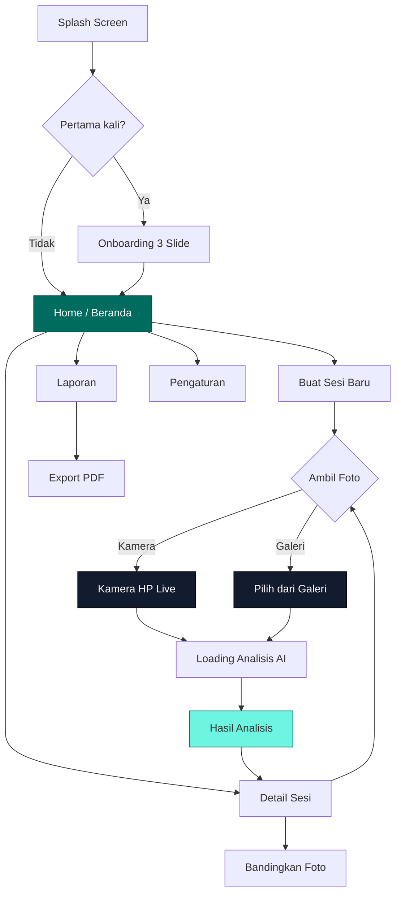

# Wound Analyzer AI — PRD & Implementation Plan
## Tugas Akhir Mata Kuliah Sistem Multimedia | UNNES

> **Platform:** PWA (Progressive Web App) — HTML/CSS/JS  
> **Fokus Utama:** Pemanfaatan teknologi kamera HP untuk pelaporan berkala luka  
> **AI:** Simulasi realistis (mock segmentation) untuk demo  
> **Design System:** Warm Clinical Premium (Be Vietnam Pro, Medical Teal)  
> **Bahasa Interface:** Bahasa Indonesia — kata-kata sederhana, mudah dipahami  
> **Versi Dokumen:** 3.1 | 3 Juni 2026

---

## Daftar Isi

| # | Bagian | Konten |
|---|--------|--------|
| 1 | [Ringkasan Proyek](#1-ringkasan-proyek) | Context, goals, skenario demo |
| 2 | [Prioritas Fitur](#2-prioritas-fitur) | Must / Should / Won't |
| 3 | [Skenario Demo](#3-skenario-demo) | Cara demo tanpa pasien luka |
| 4 | [User Flow & Navigation](#4-user-flow--navigation) | Alur pengguna |
| 5 | [Screen Specifications](#5-screen-specifications) | Detail 8 screens |
| 6 | [Design System](#6-design-system) | Token, komponen, icon |
| 7 | [Animasi & Interaksi](#7-animasi--interaksi) | Transisi, micro-interactions, gesture |
| 8 | [Tech Stack & Architecture](#8-tech-stack--architecture) | Teknologi & struktur |
| 9 | [Verification Plan](#9-verification-plan) | Testing & demo |

---

## 1. Ringkasan Proyek

### 1.1 Konteks

Proyek ini adalah **Tugas Akhir mata kuliah Sistem Multimedia** (Semester 4). Cakupannya disesuaikan agar realistis:

| Aspek | PRD Asli (Skripsi) | Versi Ini (Tugas Akhir) |
|-------|---------------------|--------------------------|
| **Timeline** | 16 minggu | Intensif |
| **Platform** | Flutter (Dart) native | PWA (HTML/CSS/JS) — installable di HP |
| **AI Model** | Train U-Net + TFLite | Simulasi AI realistis |
| **Database** | SQLite | IndexedDB (browser) |
| **Fokus** | Riset AI | **Pemanfaatan kamera HP + pelaporan berkala** |

### 1.2 Proposisi Nilai

```
Foto luka (kamera / upload) → Analisis AI (simulasi) → Estimasi area → Grafik progres → Laporan PDF
```

### 1.3 Tujuan Utama

> **Menonjolkan pemanfaatan teknologi kamera HP untuk memberikan laporan berkala luka.**

| # | Tujuan | Indikator |
|---|--------|-----------|
| T1 | **Kamera HP** — ambil foto langsung dari app | Kamera terbuka, foto tersimpan |
| T2 | **Upload Galeri** — unggah foto yang sudah ada | Foto dari galeri berhasil dimuat & dianalisis |
| T3 | Simulasi analisis AI yang terlihat realistis | Overlay mask + persentase area muncul |
| T4 | Riwayat foto tersimpan & bisa dilihat kembali | Data persist di IndexedDB |
| T5 | Grafik tren perkembangan luka | Line chart area luka vs waktu |
| T6 | Export laporan PDF | File PDF berisi foto + data + grafik |

### 1.4 Mengapa PWA?

- **Familiar** — HTML/CSS/JS, tidak perlu setup Flutter
- **Bisa diinstall di HP** — via Chrome, icon di home screen, full-screen
- **Akses kamera HP** — via MediaDevices API (standar browser)
- **Offline** — Service Worker menyimpan cache
- **Demo mudah** — langsung di HP tanpa sideload APK

---

## 2. Prioritas Fitur

### Fitur yang HARUS ada (Must Have)

| # | Fitur | Alasan |
|---|-------|--------|
| 1 | **Ambil foto via kamera HP** | Tujuan utama proyek |
| 2 | **Upload foto dari galeri** | Untuk demo — upload foto luka dari Kaggle |
| 3 | **Loading "analisis AI"** | Kesan proses AI berjalan (2-3 detik) |
| 4 | **Overlay mask luka** + toggle on/off | Output visual utama AI |
| 5 | **Persentase area luka** + estimasi cm² | Data kuantitatif |
| 6 | **Buat & kelola sesi luka** | Organisasi data per luka |
| 7 | **Riwayat foto per sesi** (timeline) | Dokumentasi berkala |
| 8 | **Grafik progres** (line chart) | Visualisasi tren |
| 9 | **Tren badge** (Membaik/Stabil/Memburuk) | Info utama yang cepat dibaca |
| 10 | **Export PDF** | Output akhir — laporan berkala |
| 11 | **Onboarding** (3 slide) | First-time UX |
| 12 | **Empty states** | UX ketika belum ada data |
| 13 | **Disclaimer medis** | Etika — app bukan alat diagnosis |

### Fitur yang SEBAIKNYA ada (Should Have)

| # | Fitur | Alasan |
|---|-------|--------|
| 1 | Perbandingan foto sebelum/sesudah (side-by-side sederhana) | Value proposition pelaporan berkala |
| 2 | Catatan per foto | Konteks tambahan |
| 3 | Pengingat harian (notifikasi) | Mendorong pemakaian rutin |
| 4 | Installable PWA (manifest + service worker) | Kesan native app |
| 5 | Camera guide overlay (grid + tips) | Konsistensi foto |

### Fitur yang DIHAPUS (Won't Have)

| # | Fitur | Alasan Dihapus |
|---|-------|----------------|
| 1 | ~~Body Map SVG interaktif~~ | Terlalu rumit — ganti dengan **chip selector sederhana** |
| 2 | ~~Comparison Slider (drag reveal)~~ | Cukup side-by-side biasa |
| 3 | ~~Photo Quality Check (blur/brightness)~~ | Kompleksitas tidak sepadan |
| 4 | ~~Haptic Feedback (vibrate)~~ | Nice-to-have, tidak kritis |
| 5 | ~~Pull-to-Refresh~~ | Tidak perlu, data lokal |
| 6 | ~~Wound Color Analysis~~ | Terlalu teknis untuk scope ini |
| 7 | ~~Notifikasi harian~~ | Perlu izin tambahan, ribet di PWA |
| 8 | ~~FAQ & Panduan section~~ | Over-engineering untuk tugas kuliah |
| 9 | ~~Tema Light/Dark toggle~~ | Tidak kritis, tambah kompleksitas |
| 10 | ~~Font size adjustment~~ | Cukup ukuran default yang jelas |
| 11 | ~~Search & filter sesi~~ | Tidak perlu untuk jumlah sesi kecil |
| 12 | ~~Export CSV~~ | PDF sudah cukup |
| 13 | ~~Full Chart Screen terpisah~~ | Cukup di dalam Session Detail |
| 14 | ~~Entry Detail Screen terpisah~~ | Cukup modal/expandable di timeline |

---

## 3. Skenario Demo

> [!IMPORTANT]
> **Masalah:** Saat demo, tidak ada orang yang sakit kulit untuk difoto langsung.
> 
> **Solusi:** Dual input — kamera untuk kulit sehat (demo kemampuan kamera) + upload foto luka dari Kaggle (demo kemampuan analisis).

### 3.1 Alur Demo yang Direkomendasikan (5-7 menit)

| Waktu | Langkah | Cara | Yang Ditunjukkan |
|-------|---------|------|------------------|
| 0:00 | Buka app, tunjukkan onboarding | Swipe 3 slide | UX & desain premium |
| 0:45 | Buat sesi baru: "Luka Kaki Kiri" | Isi form, pilih lokasi | Fitur manajemen sesi |
| 1:15 | **Demo Kamera HP** — foto kulit tangan/kaki sendiri | Tap tombol kamera, ambil foto LIVE | **Pemanfaatan kamera HP** |
| 2:00 | Lihat hasil analisis (kulit sehat = area kecil/0%) | Otomatis setelah capture | Proses AI + overlay |
| 2:30 | **Upload foto luka** dari galeri (foto Kaggle) — foto 1 | Tap icon galeri, pilih foto | **Fitur upload dari galeri** |
| 3:00 | Lihat hasil analisis (luka terdeteksi, area 18%) | Loading → mask + data | AI segmentasi + estimasi |
| 3:30 | Upload foto luka lagi (Kaggle) — foto 2 (lebih sembuh) | Tap "Foto Baru" → galeri | Data berkala masuk |
| 4:00 | Upload foto luka lagi (Kaggle) — foto 3 (makin kecil) | Tap "Foto Baru" → galeri | Tren terbentuk |
| 4:30 | Lihat **grafik progres** — area luka menurun | Scroll di Session Detail | Visualisasi tren membaik |
| 5:15 | Bandingkan foto pertama vs terakhir | Side-by-side view | Before/after visual |
| 5:45 | **Export PDF** | Tap "Export Laporan" | Output akhir |
| 6:15 | Tunjukkan data masih ada setelah tutup-buka app | Close & reopen | Offline + persistence |

### 3.2 Persiapan Sebelum Demo

1. **Siapkan 3-5 foto luka** dari dataset Kaggle di galeri HP
   - Pilih foto yang progresif: luka besar → sedang → kecil
   - Ini akan membuat grafik progres terlihat "membaik"
2. **Pastikan app sudah ter-install** di HP (PWA via Chrome)
3. **Pastikan kamera HP berfungsi** di browser
4. **Opsional:** Pre-load 1 sesi demo dengan beberapa entri agar dashboard tidak kosong saat buka

### 3.3 Skenario Fallback

| Masalah | Solusi |
|---------|--------|
| Kamera HP tidak bisa diakses di browser | Gunakan upload galeri saja (semua foto) |
| Foto Kaggle tidak ada di galeri | Download dulu dari internet |
| Demo di laptop (bukan HP) | Pakai webcam laptop + upload file |

---

## 4. User Flow & Navigation

### 4.1 Flow Utama



### 4.2 Bottom Navigation (3 tab — disederhanakan dari 4)

| Tab | Icon | Label | Screen |
|-----|------|-------|--------|
| 1 | `home` | Beranda | Dashboard utama |
| 2 | `bar_chart` | Laporan | Export PDF |
| 3 | `settings` | Pengaturan | Settings |

> [!NOTE]
> Dihapus dari 4 tab menjadi 3. Tab "Riwayat" tidak perlu terpisah — riwayat sudah ada di dalam **Detail Sesi**.

### 4.3 Alur Inti (Core Task)

```
Buka App → Beranda → Tap sesi → "Tambah Foto" → 
Pilih: [Kamera HP] atau [Upload dari Galeri] →
Foto dipilih/diambil → Loading "Menganalisis..." (2-3 detik) →
Hasil: foto + overlay + % area + tren →
Tambah catatan (opsional) → Simpan →
Kembali ke Detail Sesi (grafik ter-update)
```

**Target waktu alur inti: < 30 detik**

---

## 5. Screen Specifications

> [!NOTE]
> Total **8 screen** (dipangkas dari 11). Setiap screen menjelaskan layout, elemen, dan interaksi.

---

### Screen 1: Splash Screen

**Durasi:** 1.5 detik, auto-dismiss

| Elemen | Detail |
|--------|--------|
| Logo | Icon medis + teks "Wound Analyzer AI" di tengah layar |
| Tagline | "Pantau Kesembuhan Luka Anda" |
| Background | Gradient halus `#f8f9ff` → `#e5eeff` |
| Animasi | Logo fade-in + scale-up (300ms ease-out) |

---

### Screen 2: Onboarding (3 Slide — disederhanakan dari 4)

**Slide 1 — Selamat Datang**

| Elemen | Detail |
|--------|--------|
| Icon | `photo_camera` besar di dalam lingkaran teal |
| Judul | "Pantau Luka Anda dengan Mudah" |
| Keterangan | "Foto luka secara rutin langsung dari kamera HP atau upload dari galeri. AI akan membantu menganalisis perkembangannya." |

**Slide 2 — Cara Kerja**

| Elemen | Detail |
|--------|--------|
| 3 langkah | Icon `photo_camera` → `neurology` → `trending_down` |
| Label | "1. Foto Luka" → "2. Analisis Otomatis" → "3. Lihat Perkembangan" |
| Judul | "Tiga Langkah Sederhana" |
| Animasi | Icon menyala bergantian (pulse) |

**Slide 3 — Mulai**

| Elemen | Detail |
|--------|--------|
| Icon | `lock` dengan background shield |
| Judul | "Data Tersimpan di HP Anda" |
| Poin | "Semua foto dan data hanya ada di HP Anda. Tidak dikirim ke mana-mana." |
| Tombol | "Mulai Sekarang" (full-width, teal, 56px) |

**Komponen:**
- Progress dots (3) — dot aktif: teal memanjang, dot lain: bulat abu
- Tombol "Lewati" di kanan atas
- Swipe gesture antar slide
- Tombol panah (→) di kanan bawah

---

### Screen 3: Beranda (Home Dashboard)

**Layout atas ke bawah:**

**1. App Bar**
- Tengah: "Wound Analyzer AI" (bold)
- Kanan: tidak ada (simplified — tanpa notifikasi)

**2. Sapaan + Tanggal**
- "Selamat Pagi" / "Selamat Siang" / "Selamat Malam" (otomatis berdasarkan jam)
- "Selasa, 3 Juni 2026"

**3. Kartu Ringkasan**
- Label: "RINGKASAN" (uppercase, kecil)
- "3 Sesi Luka Aktif" (angka besar)
- 3 badge status: "2 Membaik" (teal) · "1 Stabil" (kuning) · "0 Memburuk" (merah)

**4. Daftar Sesi**
- Header: "Sesi Luka Aktif"
- Per kartu sesi:
  - Foto terakhir (thumbnail 64x64, rounded)
  - Nama: "Luka Kaki Kiri" (bold)
  - Chip lokasi: "Kaki"
  - Badge tren: icon + "Membaik" (warna)
  - "Terakhir: 2 jam lalu" (abu-abu)
  - Sparkline mini (kanan)
  - Tap → masuk Detail Sesi

**5. Keadaan Kosong** (jika belum ada sesi)
- Icon `healing` (besar, abu)
- "Belum Ada Sesi"
- "Mulai pantau luka Anda dengan membuat sesi baru"
- Tombol: "+ Buat Sesi Baru" (teal, full-width)

**6. Tombol Aksi Utama (FAB)**
- "+ Sesi Baru" (teal, rounded, posisi kanan bawah, mengambang)

**7. Bottom Navigation**
- 3 tab: Beranda (aktif) · Laporan · Pengaturan

---

### Screen 4: Buat Sesi Baru

**Layout:** Form satu kolom, simpel

| Field | Tipe | Detail |
|-------|------|--------|
| Nama Luka | Input teks | Wajib, maks 50 huruf, contoh: "Luka Kaki Kiri" |
| Lokasi Tubuh | **Chip selector** (bukan body map SVG) | Pilihan: Kepala · Leher · Dada · Perut · Punggung · Lengan Kanan · Lengan Kiri · Kaki Kanan · Kaki Kiri · Lainnya |
| Tanggal | Date picker | Default: hari ini |
| Catatan | Textarea | Tidak wajib, contoh: "Luka bekas operasi minggu lalu" |

**Chip Selector:**
- Grid 2-3 kolom, rounded chips
- Tap → terisi warna teal (selected)
- Hanya bisa pilih 1

**Tombol:**
- "Buat Sesi" (teal, full-width, 56px)
- Disabled kalau nama & lokasi belum diisi
- Setelah tap → langsung masuk pilihan Kamera / Upload

---

### Screen 5: Ambil/Upload Foto

> [!IMPORTANT]
> Screen ini adalah **inti proyek** — harus menunjukkan dua kemampuan: kamera HP live & upload galeri.

**Ada 2 mode akses foto, masing-masing harus sama mudahnya:**

#### Mode A: Kamera HP (Live)

| Elemen | Posisi | Detail |
|--------|--------|--------|
| Viewfinder kamera | Full screen | `getUserMedia()`, kamera belakang default |
| Panduan area | Tengah | Kotak garis putus-putus + "Arahkan ke area luka" |
| Grid 3x3 | Overlay | Garis tipis putih 10% opacity |
| Tips | Atas | "Pastikan cahaya cukup" (teks kecil) |
| Tombol Ambil Foto | Bawah tengah | Lingkaran putih besar 72px |
| Tombol Upload | Bawah kiri | Icon `photo_library` + label "Galeri" |
| Tombol Flash | Bawah kanan | Icon `flash_off` / `flash_on` |
| Tombol Tutup | Kiri atas | Icon `close` |
| Nama Sesi | Tengah atas | Chip: "Luka Kaki Kiri" |

**Setelah foto diambil:** langsung masuk Screen Loading Analisis.

#### Mode B: Upload dari Galeri

| Elemen | Detail |
|--------|--------|
| Trigger | Tap icon `photo_library` "Galeri" di Camera Screen **ATAU** tombol "Upload dari Galeri" di pilihan awal |
| File picker | `<input type="file" accept="image/*">` — buka galeri HP |
| Preview | Setelah foto dipilih, tampilkan preview + tombol "Analisis Foto Ini" |
| Fallback | Jika kamera tidak tersedia (misal di laptop), **mode upload adalah satu-satunya opsi** — harus tetap bisa pakai |

**Flow pemilihan saat tap "Tambah Foto" di Session Detail:**

```
┌─────────────────────────────┐
│      Tambah Foto Baru       │
│                             │
│  ┌───────────┐ ┌──────────┐ │
│  │ 📷 Kamera │ │ 🖼 Galeri │ │
│  │  HP Live  │ │  Upload  │ │
│  └───────────┘ └──────────┘ │
│                             │
│  Ambil foto langsung dari   │
│  kamera atau pilih dari     │
│  galeri HP Anda             │
└─────────────────────────────┘
```

Tampilan ini bisa berupa:
- **Bottom sheet** yang muncul saat tap "Tambah Foto"
- Dua tombol besar yang jelas dan setara (bukan satu besar satu kecil)

---

### Screen 6: Loading Analisis + Hasil Analisis

**Bagian A: Loading (2-3 detik)**

| Elemen | Detail |
|--------|--------|
| Background | Foto yang baru diambil/upload, blur + overlay gelap 60% |
| Spinner | Lingkaran berputar, warna teal, 64px |
| Teks berganti | "Mendeteksi area luka..." → "Mengukur ukuran..." → "Hampir selesai..." |
| Scan line | Garis teal horizontal bergerak atas-bawah (animasi CSS) |

**Bagian B: Hasil (setelah loading selesai)**

Mengikuti desain mockup analysis result dengan perbaikan bahasa:

**Section Foto:**
- Foto full-width di atas layar
- Badge: icon `check_circle` + "ANALISIS SELESAI"
- Toggle: "Tampilkan Overlay" (on/off)
- Overlay: area teal transparan di atas foto (simulasi area luka)

**Section Data:**
- Judul: "Hasil Analisis" (bukan "Laporan Klinis" — terlalu medis)
- Sub: "Dihasilkan oleh modul AI"
- 2 kartu metrik:
  - "Area Luka" — **12.4%** — "dari foto yang diambil"
  - "Perkiraan Ukuran" — **12.4 cm²** — "Membaik -2.1%" (warna teal)
- Badge kepercayaan: icon `verified` + "Tingkat Deteksi: 94%"

**Section Tren (jika bukan foto pertama):**
- Icon + teks: "Dibanding foto sebelumnya: area berkurang 2.1%"
- Warna sesuai tren (teal = membaik, merah = memburuk, abu = stabil)

**Section Tips:**
- Judul: "TIPS UMUM"
- Bullet points sederhana:
  - "Lanjutkan perawatan rutin"
  - "Jaga kebersihan area sekitar"
  - "Foto kembali dalam 2-3 hari untuk melihat perkembangan"
- **Disclaimer:** *"Ini bukan saran medis. Selalu konsultasikan dengan dokter."* (teks kecil, abu)

**Section Catatan:**
- Input teks: "Tulis catatan untuk foto ini..." (opsional)

**Tombol Aksi:**
- "Foto Ulang" (outline, icon `camera_enhance`) — kembali ke kamera
- "Simpan" (teal, icon `check_circle`) — simpan ke sesi

---

### Screen 7: Detail Sesi

**Header:**
- Tombol kembali + nama sesi ("Luka Kaki Kiri") + ikon titik tiga (edit/hapus)

**Kartu Statistik (2x2):**

| Kartu | Isi | Icon |
|-------|-----|------|
| Hari Dipantau | **14** | `calendar_today` |
| Total Foto | **8** | `photo_library` |
| Tren | **Membaik** (badge teal) | `trending_down` |
| Area Terkecil | **12 cm²** | `straighten` |

**Grafik Progres:**
- Line chart: sumbu X = tanggal, sumbu Y = area luka (cm²)
- Garis warna teal, area bawah diberi gradient transparan
- Titik-titik data bisa di-tap (muncul tooltip: tanggal + area)
- Filter: "7 Hari" | "1 Bulan" | "Semua" (chip toggle)
- Insight: "Area luka berkurang **18%** dalam seminggu" (teks di bawah grafik)

**Perbandingan Foto (Before/After):**
- Jika ada ≥ 2 foto: tampilkan side-by-side sederhana
  - Panel kiri: foto pertama + tanggal + area
  - Panel kanan: foto terakhir + tanggal + area
  - Teks: "Perubahan: -5.2% dalam 14 hari"
- Jika hanya 1 foto: tidak tampil

**Riwayat Foto:**
- Header: "Riwayat Pemantauan"
- Per entri:
  - Thumbnail foto (48x48)
  - Tanggal & waktu
  - "Area: 12.1 cm²"
  - Badge delta: "-2.4%" (teal) atau "+1.2%" (merah) atau "0%" (abu)
  - Tap → expand: foto lebih besar + catatan

**Tombol Aksi (sticky bottom atau FAB):**

```
┌────────────────────────────────────────┐
│  [📷 Kamera]        [🖼 Upload Galeri] │
│      Tambah Foto Baru                  │
└────────────────────────────────────────┘
```

Dua tombol yang **sama besar, sama prominent** — kamera dan upload setara.

---

### Screen 8: Laporan & Export

**Layout sederhana:**

**1. Pilih Sesi**
- Dropdown: pilih sesi yang mau di-export
- Default: sesi yang terakhir dilihat

**2. Preview Laporan**
- Kartu preview yang menampilkan:
  - Nama sesi + tanggal mulai
  - Foto pertama & terakhir (thumbnail)
  - Grafik mini
  - Total entri foto

**3. Tombol Export**
- "Buat Laporan PDF" (teal, full-width, icon `picture_as_pdf`)
- Setelah berhasil: muncul opsi share (kirim via WhatsApp, Email, dll.)

> [!NOTE]
> Disederhanakan dari versi sebelumnya — tidak perlu konfigurasi toggle (foto/grafik/tabel) dan date range picker. Semua data sesi langsung masuk PDF.

---

### Screen 9: Pengaturan (Settings)

**Layout:** Daftar sederhana

| Section | Item | Detail |
|---------|------|--------|
| **Data** | Pemakaian Ruang | Progress bar (MB yang dipakai) |
| | Hapus Semua Data | Warna merah, **konfirmasi 2x** sebelum hapus |
| **Tentang** | Versi Aplikasi | v1.0.0 |
| | Tentang Aplikasi | Deskripsi singkat |
| | **Peringatan Medis** | "Aplikasi ini hanya alat bantu dokumentasi visual. Hasil analisis bukan diagnosis medis. Selalu konsultasikan kondisi luka Anda dengan dokter atau tenaga kesehatan." |

> [!NOTE]
> Disederhanakan drastis — hapus pengingat (notifikasi), tema, font size, FAQ, panduan. Fokus ke yang benar-benar perlu.

---

## 6. Design System

### 6.1 Warna (Warm Clinical Premium)

Dari [DESIGN.md](file:///d:/UNNES/Tugas/Semester_4/Sistem%20Multimedia/Projek_Akhir/stitch_wound_analyzer_ai/warm_clinical_premium/DESIGN.md):

| Token | Warna | Kapan Dipakai |
|-------|-------|---------------|
| `secondary` | `#006b5f` | **Warna utama** — tombol, aksen, interaktif |
| `on-secondary` | `#ffffff` | Teks di atas tombol teal |
| `secondary-container` | `#6df5e1` | Tab aktif, badge ringan |
| `background` | `#f8f9ff` | Latar belakang halaman |
| `surface` | `#f8f9ff` | Latar kartu |
| `surface-container-low` | `#eff4ff` | Kartu yang lebih terang |
| `on-surface` | `#0b1c30` | Teks utama |
| `on-surface-variant` | `#45464d` | Teks sekunder |
| `outline-variant` | `#c6c6cd` | Garis pembatas halus |
| `error` | `#ba1a1a` | Hapus, memburuk |

**Warna Status:**

| Status | Latar | Teks | Icon |
|--------|-------|------|------|
| Membaik | `#006b5f` 10% | `#006b5f` | `trending_down` |
| Stabil | `#f59e0b` 10% | `#b45309` | `trending_flat` |
| Memburuk | `#ba1a1a` 10% | `#ba1a1a` | `trending_up` |

### 6.2 Huruf (Typography)

**Font:** Be Vietnam Pro (Google Fonts)

| Peran | Ukuran | Tebal | Kapan Dipakai |
|-------|--------|-------|---------------|
| Judul besar | 28px | 600 | Headline di onboarding |
| Judul sedang | 24px | 600 | Judul screen |
| Teks biasa | 16px | 400 | Body text |
| Teks kecil | 14px | 400 | Keterangan, sub-label |
| Label | 14px | 600 | Label tombol, chip |
| Label kecil | 12px | 600 | Badge, uppercase label |

### 6.3 Icon

> [!IMPORTANT]
> Gunakan **Material Symbols Outlined** — bukan emoji!

| Konteks | Nama Icon |
|---------|-----------|
| Kamera | `photo_camera` |
| Galeri/Upload | `photo_library` |
| Analisis | `neurology` |
| Terverifikasi | `verified` (filled) |
| Membaik | `trending_down` |
| Stabil | `trending_flat` |
| Memburuk | `trending_up` |
| Simpan | `check_circle` (filled) |
| Hapus | `delete_forever` |
| PDF | `picture_as_pdf` |
| Kalender | `calendar_today` |
| Kunci/Privasi | `lock` (filled) |
| Flash | `flash_on` / `flash_off` |
| Tutup | `close` |
| Kembali | `arrow_back` |
| Beranda | `home` |
| Laporan | `bar_chart` |
| Pengaturan | `settings` |
| Luka/Sesi | `healing` |
| Ukuran | `straighten` |
| Foto | `camera_enhance` |
| Tambah | `add` |

### 6.4 Komponen Utama

| Komponen | Spesifikasi |
|----------|-------------|
| **Kartu Sesi** | Thumbnail 64px + info + sparkline, border tipis, rounded 16px |
| **Badge Status** | Rounded-full, latar status 10%, ikon + label, tinggi 28px |
| **Kartu Statistik** | Latar `#eff4ff`, rounded 16px, label kecil uppercase + angka besar |
| **Tombol Utama** | Latar `#006b5f`, teks putih, tinggi 48-56px, rounded 16px |
| **Tombol Outline** | Latar putih, border abu, teks gelap, tinggi 48-56px, rounded 16px |
| **Input Teks** | Latar putih, border abu, rounded 16px, padding 16px |
| **Bottom Nav** | Latar putih, border atas, tinggi 64px |
| **FAB** | Latar teal, teks putih, rounded-full, bayangan halus |
| **Chip Selector** | Rounded-full, outline saat tidak aktif, filled teal saat aktif |

### 6.5 Bayangan (Shadow)

```css
/* Bayangan kartu — sangat halus */
--shadow-card: 0 2px 20px rgba(11, 28, 48, 0.04);

/* Bayangan tombol mengambang */
--shadow-fab: 0 4px 24px rgba(11, 28, 48, 0.10);

/* Bayangan bottom sheet */
--shadow-sheet: 0 -4px 20px rgba(11, 28, 48, 0.06);
```

---

## 7. Animasi & Interaksi

> [!IMPORTANT]
> Animasi dan micro-interactions membuat app terasa **hidup, responsif, dan premium**. Tanpa ini, app akan terasa kaku seperti slide PowerPoint. Section ini mendefinisikan SEMUA animasi yang harus ada.

### 7.1 Prinsip Animasi

| Prinsip | Penjelasan |
|---------|------------|
| **Cepat & halus** | Transisi 200-400ms, tidak lambat, tidak terlalu cepat |
| **Bermakna** | Setiap animasi punya tujuan — bukan sekadar hiasan |
| **Konsisten** | Easing yang sama di seluruh app: `cubic-bezier(0.4, 0, 0.2, 1)` |
| **Tidak menghalangi** | User tidak harus menunggu animasi selesai untuk melanjutkan |
| **Feedback instan** | Setiap tap/klik langsung ada respons visual (< 100ms) |

### 7.2 Transisi Antar Halaman

| Dari → Ke | Jenis Transisi | Durasi |
|-----------|----------------|--------|
| Splash → Beranda | Fade out splash, fade in beranda | 500ms |
| Beranda → Detail Sesi | Slide dari kanan + fade | 300ms |
| Detail Sesi → Kembali | Slide ke kanan + fade | 250ms |
| Beranda → Buat Sesi | Slide dari bawah (bottom sheet feel) | 350ms |
| Kamera → Hasil Analisis | Cross-fade melalui loading overlay | 400ms |
| Tap bottom nav | Fade sederhana (tanpa slide) | 200ms |
| Bottom sheet muncul | Slide dari bawah + backdrop fade gelap | 300ms |
| Bottom sheet tutup | Slide ke bawah + backdrop fade hilang | 250ms |
| Modal/dialog muncul | Scale dari 95%→100% + fade in + backdrop | 250ms |
| Modal/dialog tutup | Scale 100%→95% + fade out | 200ms |

**CSS untuk transisi halaman:**
```css
/* Screen masuk (slide dari kanan) */
@keyframes slideInRight {
  from {
    transform: translateX(30px);
    opacity: 0;
  }
  to {
    transform: translateX(0);
    opacity: 1;
  }
}

/* Screen keluar (slide ke kanan) */
@keyframes slideOutRight {
  from {
    transform: translateX(0);
    opacity: 1;
  }
  to {
    transform: translateX(30px);
    opacity: 0;
  }
}

/* Bottom sheet naik */
@keyframes slideUp {
  from {
    transform: translateY(100%);
  }
  to {
    transform: translateY(0);
  }
}

/* Fade halus */
@keyframes fadeIn {
  from { opacity: 0; }
  to { opacity: 1; }
}

/* Backdrop gelap */
@keyframes backdropIn {
  from { background-color: rgba(0, 0, 0, 0); }
  to { background-color: rgba(0, 0, 0, 0.4); }
}

.screen-enter {
  animation: slideInRight 300ms cubic-bezier(0.4, 0, 0.2, 1) forwards;
}
.screen-exit {
  animation: slideOutRight 250ms cubic-bezier(0.4, 0, 0.2, 1) forwards;
}
```

### 7.3 Animasi Per Screen

---

#### Splash Screen

| Animasi | Detail |
|---------|--------|
| Logo muncul | Scale dari 80%→100% + fade in, 600ms, ease-out |
| Tagline muncul | Fade in + slide up 10px, delay 300ms setelah logo |
| Auto-dismiss | Fade out seluruh screen setelah 1.5 detik |

```css
@keyframes logoReveal {
  from {
    transform: scale(0.8);
    opacity: 0;
  }
  to {
    transform: scale(1);
    opacity: 1;
  }
}
```

---

#### Onboarding

| Animasi | Detail |
|---------|--------|
| Slide transition | Geser horizontal (slide-left/right), 400ms |
| Icon slide 2 (3 langkah) | Menyala bergantian setiap 1.5 detik — pulse glow effect |
| Progress dots | Dot aktif: melebar 6px→24px, warna berubah ke teal, 300ms |
| Tombol panah (→) | Hover/tap: scale 1→1.1 + bayangan membesar |
| Tombol "Mulai Sekarang" | Shimmer effect halus (gradient bergerak) saat idle |
| Swipe gesture | Spring-physics feel — konten ikut jari, snap ke slide |

```css
/* Pulse glow untuk icon langkah */
@keyframes pulseGlow {
  0%, 100% {
    transform: scale(1);
    box-shadow: 0 0 0 0 rgba(0, 107, 95, 0.4);
  }
  50% {
    transform: scale(1.1);
    box-shadow: 0 0 0 12px rgba(0, 107, 95, 0);
  }
}

/* Shimmer pada tombol CTA */
@keyframes shimmer {
  0% {
    background-position: -200% center;
  }
  100% {
    background-position: 200% center;
  }
}
.btn-shimmer {
  background: linear-gradient(
    90deg,
    #006b5f 0%,
    #00897b 50%,
    #006b5f 100%
  );
  background-size: 200% 100%;
  animation: shimmer 3s ease-in-out infinite;
}

/* Progress dot active */
.dot-active {
  width: 24px;
  background-color: var(--secondary);
  transition: width 300ms cubic-bezier(0.4, 0, 0.2, 1),
              background-color 300ms ease;
}
.dot-inactive {
  width: 8px;
  background-color: var(--outline-variant);
  transition: width 300ms cubic-bezier(0.4, 0, 0.2, 1),
              background-color 300ms ease;
}
```

---

#### Beranda (Home Dashboard)

| Animasi | Detail |
|---------|--------|
| Sapaan + tanggal | Fade in + slide down 15px, 400ms, saat halaman dimuat |
| Kartu ringkasan | Fade in + slide up 20px, delay 100ms setelah sapaan |
| Badge status (Membaik/Stabil/Memburuk) | Muncul satu per satu, stagger 80ms antar badge |
| Kartu sesi | **Staggered entrance** — muncul satu per satu dari bawah, delay 60ms antar kartu |
| Sparkline mini chart | Garis ter-animasi dari kiri ke kanan (draw-in), 800ms |
| FAB "+ Sesi Baru" | Muncul dari bawah dengan bounce ringan, delay 400ms |
| Tap kartu sesi | Kartu: scale 98% + shadow berkurang (press effect), 100ms |
| Scroll | Bottom nav: bayangan membesar saat user scroll ke bawah |
| Empty state | Icon pulse pelan + teks fade in stagger |

```css
/* Staggered entrance untuk daftar kartu */
.session-card {
  opacity: 0;
  transform: translateY(20px);
  animation: cardEnter 400ms cubic-bezier(0.4, 0, 0.2, 1) forwards;
}
.session-card:nth-child(1) { animation-delay: 0ms; }
.session-card:nth-child(2) { animation-delay: 60ms; }
.session-card:nth-child(3) { animation-delay: 120ms; }
.session-card:nth-child(4) { animation-delay: 180ms; }

@keyframes cardEnter {
  to {
    opacity: 1;
    transform: translateY(0);
  }
}

/* FAB bounce entrance */
@keyframes fabBounce {
  0% {
    transform: translateY(80px) scale(0.8);
    opacity: 0;
  }
  60% {
    transform: translateY(-8px) scale(1.02);
    opacity: 1;
  }
  100% {
    transform: translateY(0) scale(1);
  }
}

/* Sparkline draw-in */
@keyframes drawLine {
  from { stroke-dashoffset: 200; }
  to { stroke-dashoffset: 0; }
}
.sparkline-path {
  stroke-dasharray: 200;
  animation: drawLine 800ms ease-out forwards;
}
```

---

#### Buat Sesi Baru

| Animasi | Detail |
|---------|--------|
| Form muncul | Slide dari bawah, 350ms |
| Chip selector tap | Transisi warna + scale 95%→100%, 200ms |
| Chip terpilih | Latar berubah ke teal + teks berubah putih, border hilang |
| Input focus | Border berubah ke teal + glow ring halus, 200ms |
| Tombol disabled → enabled | Opacity 0.4→1 + warna abu→teal, 300ms |
| Tap tombol "Buat Sesi" | Ripple effect dari titik tap + scale 97%, 150ms |
| Setelah berhasil | Check icon muncul (scale 0→1 + rotate) → redirect |

```css
/* Chip selection */
.chip {
  transition: all 200ms cubic-bezier(0.4, 0, 0.2, 1);
}
.chip:active {
  transform: scale(0.95);
}
.chip.selected {
  background-color: var(--secondary);
  color: white;
  border-color: var(--secondary);
  box-shadow: 0 2px 8px rgba(0, 107, 95, 0.25);
}

/* Input focus glow */
.input-field:focus {
  border-color: var(--secondary);
  box-shadow: 0 0 0 3px rgba(0, 107, 95, 0.12);
  transition: border-color 200ms ease, box-shadow 200ms ease;
}

/* Button enable transition */
.btn-primary {
  transition: opacity 300ms ease, background-color 300ms ease, transform 150ms ease;
}
.btn-primary:disabled {
  opacity: 0.4;
  background-color: var(--outline);
}
.btn-primary:active:not(:disabled) {
  transform: scale(0.97);
}
```

---

#### Kamera HP

| Animasi | Detail |
|---------|--------|
| Viewfinder muncul | Fade in dari hitam, 500ms (saat kamera initialize) |
| Guide overlay | Garis putus-putus: animasi dash bergerak (marching ants), pelan |
| Tips bar | Fade in stagger, delay 300ms setelah viewfinder ready |
| Tombol capture (tekan) | Scale 72px→65px + opacity ring outer berkurang, 100ms |
| Tombol capture (lepas) | Kembali 65px→72px + **flash putih full-screen** 120ms |
| Flash putih | Overlay putih opacity 0→0.8→0, 120ms, ease-in-out |
| Preview foto | Foto hasil muncul dari tengah (scale 0.8→1), 300ms |
| Toggle flash | Icon rotate 180° saat berubah, 200ms |
| Tombol galeri | Tap: scale 90% → 100%, 100ms |

```css
/* Marching ants untuk guide frame */
@keyframes marchingAnts {
  to { stroke-dashoffset: -20; }
}
.camera-guide {
  stroke-dasharray: 8 6;
  animation: marchingAnts 1s linear infinite;
}

/* Flash saat capture */
@keyframes cameraFlash {
  0% { opacity: 0; }
  30% { opacity: 0.8; }
  100% { opacity: 0; }
}
.flash-overlay {
  animation: cameraFlash 120ms ease-in-out;
}

/* Shutter button press */
.shutter-btn:active {
  transform: scale(0.9);
  transition: transform 100ms ease;
}
```

---

#### Loading Analisis AI

| Animasi | Detail |
|---------|--------|
| Backdrop blur | Foto blur dari 0→8px + overlay gelap fade in, 400ms |
| Spinner | Putaran terus-menerus, 1.2 detik per rotasi, ease |
| Scan line | Garis teal horizontal: bergerak dari atas ke bawah, 2.5 detik per siklus |
| Teks berganti | Fade out teks lama → fade in teks baru, setiap 1 detik |
| Pulse ring | Lingkaran di belakang spinner yang membesar + menghilang, loop |
| Selesai | Spinner → check icon (morph), ring berubah hijau |

```css
/* Scan line */
@keyframes scanLine {
  0% { top: 0%; opacity: 0; }
  10% { opacity: 1; }
  90% { opacity: 1; }
  100% { top: 100%; opacity: 0; }
}
.scan-line {
  position: absolute;
  left: 0;
  right: 0;
  height: 2px;
  background: var(--secondary);
  box-shadow: 0 0 12px rgba(0, 107, 95, 0.8);
  animation: scanLine 2.5s cubic-bezier(0.4, 0, 0.2, 1) infinite;
}

/* Spinner */
@keyframes spin {
  to { transform: rotate(360deg); }
}
.spinner {
  border: 3px solid rgba(0, 107, 95, 0.15);
  border-top-color: var(--secondary);
  border-radius: 50%;
  width: 56px;
  height: 56px;
  animation: spin 1.2s cubic-bezier(0.5, 0, 0.5, 1) infinite;
}

/* Pulse ring di belakang spinner */
@keyframes pulseRing {
  0% {
    transform: scale(1);
    opacity: 0.3;
  }
  100% {
    transform: scale(1.8);
    opacity: 0;
  }
}
.pulse-ring {
  animation: pulseRing 1.5s ease-out infinite;
}

/* Teks berganti */
@keyframes textSwap {
  0%, 10% { opacity: 0; transform: translateY(8px); }
  20%, 80% { opacity: 1; transform: translateY(0); }
  90%, 100% { opacity: 0; transform: translateY(-8px); }
}
```

---

#### Hasil Analisis

| Animasi | Detail |
|---------|--------|
| Foto + overlay | Slide up dari loading screen, 400ms |
| Badge "ANALISIS SELESAI" | Pop in (scale 0→1 + bounce), delay 200ms |
| Overlay mask | Fade in dengan pulse halus (opacity 0.3↔0.5), loop pelan |
| Bottom sheet (data) | Slide up dari bawah + rounded top corners, 350ms |
| Kartu metrik | Stagger entrance: kiri dulu, kanan delay 80ms |
| **Angka count-up** | Area "0%" → "12.4%" dalam 1 detik (easing: ease-out) |
| Badge akurasi | Fade in + slide right, delay 300ms |
| Toggle overlay | Smooth transition mask opacity 0↔0.4, 300ms |
| Tips section | Fade in, delay 400ms |
| Tombol "Simpan" | Tap: ripple + scale 97%, setelah simpan: check + redirect |

```css
/* Count-up angka — dijalankan via JavaScript */
function animateCountUp(element, target, duration = 1000) {
  const start = 0;
  const startTime = performance.now();
  
  function update(currentTime) {
    const elapsed = currentTime - startTime;
    const progress = Math.min(elapsed / duration, 1);
    // Ease-out cubic
    const eased = 1 - Math.pow(1 - progress, 3);
    const current = start + (target - start) * eased;
    element.textContent = current.toFixed(1) + '%';
    if (progress < 1) requestAnimationFrame(update);
  }
  requestAnimationFrame(update);
}

/* Mask overlay pulse */
@keyframes maskPulse {
  0%, 100% { opacity: 0.3; }
  50% { opacity: 0.45; }
}
.wound-mask {
  animation: maskPulse 4s ease-in-out infinite;
}

/* Badge pop-in */
@keyframes popIn {
  0% { transform: scale(0); opacity: 0; }
  70% { transform: scale(1.1); }
  100% { transform: scale(1); opacity: 1; }
}
```

---

#### Detail Sesi

| Animasi | Detail |
|---------|--------|
| Kartu statistik | **Count-up angka** (0→14 hari, 0→8 foto), stagger 80ms |
| Badge tren | Pop in setelah count-up selesai |
| Grafik progres | **Line draw animation** — garis tergambar dari kiri ke kanan, 1.2 detik |
| Data points grafik | Muncul satu per satu saat garis sampai, scale 0→1, 150ms |
| Area gradient | Fade in setelah garis selesai tergambar |
| Tooltip (tap data point) | Scale 0→1 dari titik yang di-tap + fade, 200ms |
| Filter chip (7 Hari/1 Bulan/Semua) | Grafik: fade out → recalculate → draw ulang |
| Before/After foto | Foto slide in dari kiri dan kanan bersamaan, 400ms |
| Riwayat entri | Stagger entrance sama seperti kartu sesi di Beranda |
| Tap entri (expand) | Expand height + foto membesar, 300ms, ease |
| Tombol Kamera/Upload | Hover: shadow membesar + scale 1.02, 200ms |

```css
/* Chart line draw */
@keyframes chartDraw {
  from {
    stroke-dashoffset: var(--line-length);
  }
  to {
    stroke-dashoffset: 0;
  }
}
.chart-line {
  stroke-dasharray: var(--line-length);
  animation: chartDraw 1.2s ease-out forwards;
}

/* Data point pop */
@keyframes dataPointPop {
  from {
    transform: scale(0);
    opacity: 0;
  }
  to {
    transform: scale(1);
    opacity: 1;
  }
}

/* Before/After slide in */
@keyframes slideFromLeft {
  from { transform: translateX(-30px); opacity: 0; }
  to { transform: translateX(0); opacity: 1; }
}
@keyframes slideFromRight {
  from { transform: translateX(30px); opacity: 0; }
  to { transform: translateX(0); opacity: 1; }
}
```

---

#### Laporan & Pengaturan

| Animasi | Detail |
|---------|--------|
| Dropdown pilih sesi | Expand/collapse smooth, 250ms |
| Preview laporan | Fade in + scale 95%→100%, 300ms |
| Tombol Export PDF | Tap: loading spinner di dalam tombol → selesai: icon check |
| Progress bar storage | Animasi fill dari 0→actual, 800ms, ease-out |
| Toggle switch | Thumb geser kiri↔kanan, track berubah warna, 200ms |
| "Hapus Semua Data" | Tap pertama: dialog konfirmasi slide up. Tap kedua: fade merah |
| Item settings | Tap: background ripple halus, 200ms |

---

### 7.4 Interaksi Komponen Global

Semua komponen ini berlaku di **seluruh** app:

| Komponen | Interaksi |
|----------|----------|
| **Semua tombol** | Tap: scale 97% (100ms) + ripple dari titik sentuh (400ms) |
| **Semua kartu** | Tap: scale 98% + shadow berkurang (100ms), lepas: kembali (150ms) |
| **Semua link/teks aktif** | Hover: opacity 0.7, tap: opacity 0.5 |
| **Input field** | Focus: border teal + glow ring 3px (200ms), blur: kembali abu |
| **Chip selector** | Tap: latar berubah + border berubah (200ms), unselect: kembali |
| **Toggle switch** | Tap: thumb geser + track berubah warna (200ms) |
| **Bottom nav tab** | Tap: icon scale 1→1.15→1 (bounce 200ms) + label fade in |
| **FAB** | Hover: shadow membesar + scale 1.05 (200ms), tap: scale 0.95 |
| **Toast notification** | Slide up dari bawah + fade in, auto-dismiss setelah 3 detik |
| **Scroll** | Smooth scroll behavior, overscroll bounce (jika browser support) |

```css
/* Ripple effect untuk tombol */
.ripple {
  position: absolute;
  border-radius: 50%;
  background: rgba(255, 255, 255, 0.3);
  transform: scale(0);
  animation: rippleExpand 400ms ease-out forwards;
  pointer-events: none;
}
@keyframes rippleExpand {
  to {
    transform: scale(4);
    opacity: 0;
  }
}

/* Press effect universal */
.pressable:active {
  transform: scale(0.97);
  transition: transform 100ms ease;
}
.card-pressable:active {
  transform: scale(0.98);
  box-shadow: 0 1px 8px rgba(11, 28, 48, 0.02);
  transition: all 100ms ease;
}

/* Bottom nav bounce */
@keyframes navBounce {
  0% { transform: scale(1); }
  40% { transform: scale(1.15); }
  100% { transform: scale(1); }
}
.nav-tab.active .nav-icon {
  animation: navBounce 200ms ease;
}

/* Toast notification */
@keyframes toastIn {
  from {
    transform: translateY(100%) translateX(-50%);
    opacity: 0;
  }
  to {
    transform: translateY(0) translateX(-50%);
    opacity: 1;
  }
}
@keyframes toastOut {
  from { opacity: 1; }
  to { opacity: 0; transform: translateY(10px) translateX(-50%); }
}
.toast {
  animation: toastIn 300ms cubic-bezier(0.4, 0, 0.2, 1) forwards;
}
.toast.dismiss {
  animation: toastOut 250ms ease forwards;
}
```

### 7.5 Gesture Support

| Gesture | Di mana | Aksi |
|---------|---------|------|
| **Swipe left/right** | Onboarding | Pindah slide |
| **Swipe down** | Bottom sheet | Tutup sheet |
| **Tap + hold** | Entri riwayat | Expand detail |
| **Pinch zoom** | Foto di kamera/hasil | Zoom in/out |
| **Scroll** | Semua halaman | Smooth scroll native |
| **Double tap** | Foto di hasil analisis | Zoom 2x |

### 7.6 Loading & Skeleton States

Saat data sedang dimuat, tampilkan **skeleton placeholder** (bukan halaman kosong):

```css
/* Skeleton shimmer */
@keyframes skeletonShimmer {
  0% {
    background-position: -200px 0;
  }
  100% {
    background-position: calc(200px + 100%) 0;
  }
}
.skeleton {
  background: linear-gradient(
    90deg,
    var(--surface-container-low) 0px,
    var(--surface-container) 40px,
    var(--surface-container-low) 80px
  );
  background-size: 200px 100%;
  animation: skeletonShimmer 1.5s ease-in-out infinite;
  border-radius: 8px;
}
```

| Di mana | Skeleton |
|---------|----------|
| Kartu sesi (loading) | Rounded rect abu shimmer 72px (foto) + 2 garis teks |
| Grafik (loading) | Rounded rect besar shimmer |
| Foto (loading) | Rounded rect shimmer aspect-ratio 4:3 |
| Statistik (loading) | 4 kotak kecil shimmer |

### 7.7 Feedback Visual untuk Aksi Penting

| Aksi | Feedback |
|------|----------|
| Foto berhasil diambil | Flash putih + getaran ringan (Vibration API 50ms) |
| Analisis selesai | Badge "ANALISIS SELESAI" pop in + ring teal pulse |
| Entri berhasil disimpan | Toast hijau: icon `check_circle` + "Berhasil disimpan" (3 detik) |
| Sesi berhasil dibuat | Toast hijau + redirect ke halaman foto |
| PDF berhasil dibuat | Toast + tombol "Buka File" muncul |
| Data dihapus | Toast merah: "Data telah dihapus" |
| Error (kamera gagal, dll.) | Toast merah: icon `error` + pesan jelas + tombol "Coba Lagi" |

---

## 8. Tech Stack & Architecture

### 8.1 Teknologi

| Teknologi | Fungsi |
|-----------|--------|
| **HTML5** | Struktur halaman |
| **CSS3** | Styling, animasi, responsif |
| **JavaScript (ES6+)** | Logika, kamera, database |
| **Be Vietnam Pro** (Google Fonts) | Font |
| **Material Symbols** (Google Fonts) | Ikon |
| **Chart.js** (CDN) | Grafik line chart |
| **jsPDF** (CDN) | Buat file PDF |
| **Service Worker** | Offline & PWA |
| **MediaDevices API** | Akses kamera HP |
| **IndexedDB** | Simpan data & foto di browser |

### 8.2 Struktur Folder

```
wound-analyzer-ai/
├── index.html              ← Halaman utama (semua screen di sini)
├── manifest.json           ← PWA config (nama, ikon, warna)
├── sw.js                   ← Service Worker (offline)
│
├── css/
│   ├── variables.css       ← Warna, ukuran, font (design tokens)
│   ├── base.css            ← Reset, body, font imports
│   ├── components.css      ← Kartu, tombol, badge, input, nav
│   ├── animations.css      ← Animasi (scan-line, fade, loading)
│   └── screens.css         ← Style per screen (semua digabung)
│
├── js/
│   ├── app.js              ← Inisialisasi, navigasi antar screen
│   ├── db.js               ← IndexedDB — simpan/baca sesi & foto
│   ├── camera.js           ← Buka kamera, ambil foto, upload galeri
│   ├── ai-mock.js          ← Simulasi AI — buat mask & hitung area
│   ├── chart.js            ← Render grafik progres
│   ├── export.js           ← Buat & download PDF
│   └── utils.js            ← Format tanggal, kompresi foto, dll.
│
├── assets/
│   ├── icons/
│   │   ├── icon-192.png    ← Ikon PWA 192x192
│   │   └── icon-512.png    ← Ikon PWA 512x512
│   └── dummy/
│       ├── wound-1.jpg     ← Contoh foto luka untuk demo
│       ├── wound-2.jpg
│       └── wound-3.jpg
│
└── README.md               ← Cara setup & jalankan
```

> [!NOTE]
> Struktur disederhanakan — tidak perlu subfolder per screen. Semua CSS screen digabung di `screens.css` agar file count lebih sedikit dan lebih mudah di-maintain.

### 8.3 Database (IndexedDB)

```javascript
// Tabel: sessions (sesi luka)
{
  id: 1,                          // auto-increment
  name: "Luka Kaki Kiri",         // nama sesi
  bodyLocation: "Kaki Kiri",      // lokasi tubuh (dari chip selector)
  startDate: "2026-06-01",        // tanggal mulai
  notes: "Bekas operasi",         // catatan (opsional)
  isActive: true,                 // masih aktif?
  createdAt: 1717200000000        // timestamp
}

// Tabel: entries (foto per sesi)
{
  id: 1,                          // auto-increment
  sessionId: 1,                   // referensi ke sesi
  photoBlob: Blob,                // foto (maks 500KB, compressed)
  source: "camera",               // "camera" atau "gallery" ← BARU
  maskData: { path: "M35,30..." },// data overlay mask (SVG path)
  areaPercent: 12.4,              // % area luka
  areaCm2: 14.5,                  // perkiraan cm²
  areaChange: -2.1,               // perubahan dari foto sebelumnya
  trend: "improving",             // "improving" / "stable" / "worsening"
  confidence: 94,                 // % tingkat deteksi (simulasi)
  notes: "Sudah mengecil",        // catatan user (opsional)
  takenAt: 1717200000000          // timestamp foto diambil
}
```

> [!IMPORTANT]
> Field `source: "camera" | "gallery"` ditambahkan untuk melacak dari mana foto berasal. Ini berguna untuk laporan.

### 8.4 Simulasi AI (Mock)

```javascript
// ai-mock.js — Cara kerja simulasi AI
async function analyzeWound(imageBlob, previousEntries) {
  // 1. Tampilkan loading 2-3 detik (kesan processing)
  await delay(2000 + Math.random() * 1000);
  
  // 2. Buat mask overlay (SVG blob shape acak tapi konsisten)
  //    Shape dibuat berdasarkan hash dari foto agar sama jika foto sama
  const maskPath = generateBlobSVGPath(imageBlob);
  
  // 3. Hitung area "luka" (simulasi)
  //    - Foto pertama: area 15-25% (acak)
  //    - Foto berikutnya: area mengecil 1-5% (simulasi "membaik")
  //    - Ini membuat grafik progres terlihat realistis saat demo
  let areaPercent;
  if (previousEntries.length === 0) {
    areaPercent = 15 + Math.random() * 10; // 15-25%
  } else {
    const lastArea = previousEntries[previousEntries.length - 1].areaPercent;
    areaPercent = Math.max(2, lastArea - (1 + Math.random() * 4)); // berkurang 1-5%
  }
  
  // 4. Hitung tren
  const trend = calculateTrend(previousEntries, areaPercent);
  
  return {
    maskPath,
    areaPercent: Math.round(areaPercent * 10) / 10,
    areaCm2: Math.round(areaPercent * 1.1 * 10) / 10,
    areaChange: previousEntries.length > 0 
      ? Math.round((areaPercent - previousEntries.at(-1).areaPercent) * 10) / 10
      : 0,
    confidence: Math.round(88 + Math.random() * 10),
    trend
  };
}
```

> [!TIP]
> Mock AI sengaja dibuat agar area **selalu berkurang** setiap foto baru. Ini membuat demo terlihat meyakinkan — grafik menunjukkan tren "membaik".

---

## 9. Verification Plan

### 9.1 Testing di HP

| # | Test | Langkah | Hasil yang Diharapkan |
|---|------|---------|----------------------|
| 1 | Install PWA | Buka di Chrome HP → menu → "Tambahkan ke Layar Utama" | Icon app muncul di home screen |
| 2 | Kamera HP | Buat sesi → tap Kamera → izinkan akses | Viewfinder kamera tampil |
| 3 | Ambil foto live | Tap tombol capture | Foto tersimpan, masuk loading analisis |
| 4 | Upload dari galeri | Tap "Galeri" → pilih foto | Foto termuat, masuk loading analisis |
| 5 | Hasil analisis | Tunggu loading selesai | Overlay mask + % area + tren tampil |
| 6 | Simpan entri | Tap "Simpan" | Kembali ke Detail Sesi, entry baru muncul |
| 7 | Grafik | Tambah 3+ foto ke 1 sesi | Line chart menampilkan tren menurun |
| 8 | Export PDF | Laporan → pilih sesi → Export | File PDF terbuat & bisa dibuka |
| 9 | Offline | Matikan internet → buka app | App tetap bisa dipakai |
| 10 | Persistence | Tutup & buka ulang app | Data masih ada |
| 11 | Animasi | Navigasi antar screen | Transisi halus tanpa lompatan |
| 12 | Interaksi | Tap tombol, kartu, chip | Feedback visual instan (ripple, scale) |

### 9.2 Demo Flow

Lihat [Section 3: Skenario Demo](#3-skenario-demo) untuk alur demo lengkap.

### 9.3 Checklist Sebelum Demo

- [ ] 3-5 foto luka dari Kaggle sudah ada di galeri HP
- [ ] App sudah ter-install sebagai PWA di HP
- [ ] Kamera HP berfungsi di browser
- [ ] Sudah pernah test: buat sesi → kamera → upload → lihat grafik → export PDF
- [ ] Semua animasi berjalan lancar (tidak lag)
- [ ] Opsional: 1 sesi demo sudah pre-loaded dengan beberapa entri

---

## Ringkasan Perubahan Desain dari Mockup Asli

| Mockup | Status | Perubahan |
|--------|--------|----------|
| Onboarding | Pakai, modifikasi | 4 slide → 3 slide, bahasa lebih sederhana |
| Home Dashboard | Pakai, modifikasi | Hapus search/filter, tambah sapaan, bottom nav 3 tab |
| Analysis Result | Pakai, modifikasi | "Laporan Klinis" → "Hasil Analisis", bahasa disederhanakan |
| Session Detail (refined) | Pakai, modifikasi | Tambah dual button Kamera/Upload, before/after sederhana |
| Session Detail (v1) | Referensi saja | Ambil ide entry card detail |
| Settings | Pakai, sederhanakan | Hapus pengingat, tema, font size |
| Camera Screen | **Buat baru** | Full-screen viewfinder + guide + upload button |
| Laporan/Export | **Buat baru** | Preview + export PDF sederhana |

---

*Dokumen ini disusun berdasarkan [PRD asli](file:///d:/UNNES/Tugas/Semester_4/Sistem%20Multimedia/Projek_Akhir/wound-analyzer-ai-prd-implementation.md), mockup [Warm Clinical Premium](file:///d:/UNNES/Tugas/Semester_4/Sistem%20Multimedia/Projek_Akhir/stitch_wound_analyzer_ai/warm_clinical_premium/DESIGN.md), dan [stitch prompt](file:///d:/UNNES/Tugas/Semester_4/Sistem%20Multimedia/Projek_Akhir/stitch-prompt-wound-analyzer-ai.md).*

*Disesuaikan untuk konteks Tugas Akhir Sistem Multimedia — demo individu, deadline intensif, tanpa pasien luka.*
