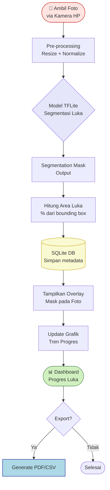
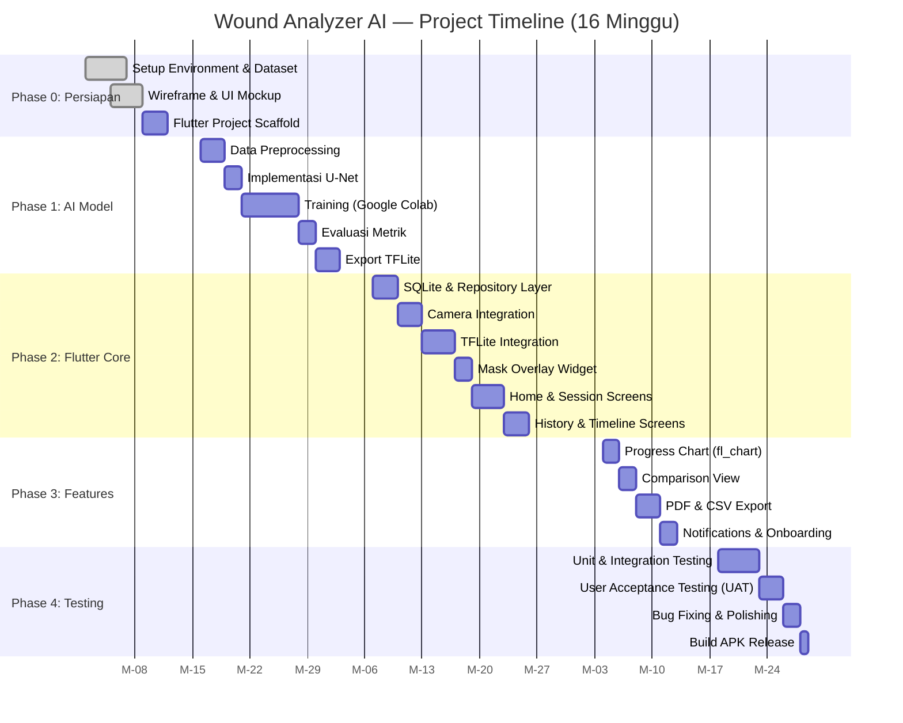

# Wound Analyzer AI
## PRD + Implementation Plan
### Skripsi — Teknik Informatika / Ilmu Komputer

> **Platform:** Flutter (Dart) · **AI:** TensorFlow Lite · **Target:** Android/iOS (Offline-first)  
> **Dataset:** Kaggle CO2Wounds v2 + Wound Segmentation Images  
> **Versi Dokumen:** 1.0 | Terakhir diperbarui: Juni 2025

---

## Daftar Isi

| # | Bagian | Konten |
|---|--------|--------|
| **BAGIAN 1** | **PRD** | Requirements, Persona, Arsitektur |
| 1 | [Ringkasan Produk](#1-ringkasan-produk) | Executive summary |
| 2 | [Latar Belakang & Problem Statement](#2-latar-belakang--problem-statement) | Konteks & masalah |
| 3 | [Visi, Misi & Tujuan](#3-visi-misi--tujuan-produk) | Goals & objectives |
| 4 | [Persona Pengguna](#4-persona-pengguna) | User personas |
| 5 | [Functional Requirements](#5-functional-requirements) | Feature specs |
| 6 | [Non-Functional Requirements](#6-non-functional-requirements) | Performance, security |
| 7 | [System Architecture](#7-system-architecture) | High-level design |
| 8 | [Batasan & Asumsi](#8-batasan--asumsi) | Scope constraints |
| 9 | [Success Metrics](#9-success-metrics) | KPI & ukuran keberhasilan |
| **BAGIAN 2** | **AI Training Guide** | Dataset, Model, Pipeline |
| 10 | [Overview Dataset Kaggle](#10-overview-dataset-kaggle) | Dataset summary |
| 11 | [Dataset 1 – CO2Wounds v2](#11-dataset-1--co2wounds-v2-leprosy--chronic-wounds) | Leprosy & chronic wounds |
| 12 | [Dataset 2 – Wound Segmentation](#12-dataset-2--wound-segmentation-images) | Segmentation masks |
| 13 | [Data Preparation Pipeline](#13-data-preparation-pipeline) | Preprocessing & augmentation |
| 14 | [Model Architecture](#14-rekomendasi-model-architecture) | U-Net + MobileNetV2 |
| 15 | [Training Strategy](#15-training-strategy) | Hyperparameters & tips |
| 16 | [Evaluation Metrics](#16-evaluation-metrics) | IoU, Dice, Accuracy |
| 17 | [Export ke TFLite](#17-export-ke-tensorflow-lite) | Model deployment pipeline |
| **BAGIAN 3** | **Implementation Plan** | Tech stack, Sprint, Risk |
| 18 | [Tech Stack](#18-tech-stack) | Semua teknologi |
| 19 | [Flutter App Architecture](#19-flutter-app-architecture) | Clean Architecture |
| 20 | [Module & Feature Breakdown](#20-module--feature-breakdown) | Struktur fitur |
| 21 | [Database Schema](#21-database-schema-sqlite) | SQLite schema |
| 22 | [Project Phases & Sprint Plan](#22-project-phases--sprint-plan) | Timeline 16 minggu |
| 23 | [Gantt Chart](#23-gantt-chart) | Visual timeline |
| 24 | [Testing Plan](#24-testing-plan) | Unit, integration, UAT |
| 25 | [Demo & Deployment](#25-demo--deployment-strategy) | APK sideload |
| 26 | [Manajemen Risiko](#26-manajemen-risiko) | Risk matrix |
| 27 | [Etika & Disclaimer](#27-etika--disclaimer) | Batasan medis |
| 28 | [Referensi](#28-referensi) | Sumber & pustaka |

---

# BAGIAN 1 — PRODUCT REQUIREMENTS DOCUMENT (PRD)

---

## 1. Ringkasan Produk

**Wound Analyzer AI** adalah aplikasi mobile berbasis **Flutter** yang memungkinkan pengguna memantau perkembangan luka secara harian menggunakan kamera smartphone. Aplikasi memanfaatkan model **Computer Vision** berbasis TensorFlow Lite untuk melakukan segmentasi area luka, estimasi ukuran, dan analisis tren penyembuhan — semuanya berjalan **secara offline di perangkat**.

### Proposisi Nilai Utama

```
Foto luka → Segmentasi otomatis → Estimasi area → Grafik progres → Laporan PDF
```

| Dimensi | Nilai |
|---------|-------|
| **Untuk siapa** | Pasien, caregiver, tenaga kesehatan di lapangan |
| **Masalah utama** | Monitoring luka yang tidak konsisten & subjektif |
| **Solusi** | Dokumentasi visual terstruktur + AI analysis on-device |
| **Keunggulan** | Offline-first, privasi data terjaga, mudah digunakan |
| **Konteks skripsi** | Implementasi Computer Vision + Mobile Development |

---

## 2. Latar Belakang & Problem Statement

### 2.1 Konteks Masalah

Luka kronis (chronic wound) — termasuk luka diabetik, luka lepra, dan pressure ulcer — merupakan kondisi yang membutuhkan pemantauan rutin. Menurut berbagai literatur medis, keterlambatan dalam mendeteksi perburukan luka dapat menyebabkan komplikasi serius hingga amputasi.

**Tantangan utama di lapangan:**

- **Subjektivitas penilaian** — tenaga kesehatan dan caregiver sering menilai luka secara visual tanpa parameter objektif
- **Dokumentasi tidak terstruktur** — foto luka tersebar di galeri HP tanpa urutan kronologis atau metadata yang bermakna
- **Aksesibilitas terbatas** — di daerah terpencil, pasien tidak selalu bisa mengakses klinik untuk pemeriksaan berkala
- **Kurangnya alat monitoring portable** — alat klinis seperti wound ruler atau planimetri digital tidak selalu tersedia

### 2.2 Problem Statement (Format IEEE/Akademik)

> *"Bagaimana merancang dan membangun aplikasi mobile berbasis Flutter dengan model segmentasi luka (TensorFlow Lite) yang mampu memantau perkembangan luka secara otomatis, terstruktur, dan dapat berjalan secara offline pada perangkat Android/iOS?"*

### 2.3 Research Questions (untuk Skripsi)

1. Bagaimana performa model segmentasi luka (U-Net) yang dilatih menggunakan dataset Kaggle CO2Wounds v2 dan Wound Segmentation Images dalam mengidentifikasi area luka?
2. Bagaimana implementasi model TensorFlow Lite dalam aplikasi Flutter untuk inferensi on-device yang efisien?
3. Seberapa akurat estimasi area luka yang dihasilkan oleh aplikasi dibandingkan dengan pengukuran manual?

---

## 3. Visi, Misi & Tujuan Produk

### 3.1 Visi

> *Menjadi alat bantu monitoring luka digital yang mudah diakses oleh siapa pun, di mana pun, tanpa memerlukan koneksi internet — memberikan informasi progres luka yang objektif dan terstruktur.*

### 3.2 Misi

- Menyederhanakan proses dokumentasi luka menjadi sekadar **foto → analisis → laporan**
- Memberikan visualisasi tren penyembuhan yang dapat dipahami oleh non-medis
- Menjaga privasi data pengguna dengan pemrosesan **fully on-device**

### 3.3 Tujuan Produk

#### Tujuan Primer
| # | Tujuan | Indikator |
|---|--------|-----------|
| T1 | Segmentasi area luka dari foto HP | Dice Score ≥ 0.75 |
| T2 | Estimasi ukuran luka (area relatif dalam %) | Error < 15% vs manual |
| T3 | Penyimpanan riwayat foto & metadata luka | 100% offline, SQLite |
| T4 | Visualisasi tren penyembuhan | Grafik > 7 hari |

#### Tujuan Sekunder
| # | Tujuan | Indikator |
|---|--------|-----------|
| S1 | Ekspor laporan PDF/CSV | Berhasil generate file |
| S2 | Notifikasi pengingat foto harian | Local notification aktif |
| S3 | Perbandingan foto berdampingan | Side-by-side view |
| S4 | Panduan pengambilan foto yang baik | Onboarding guide tersedia |

---

## 4. Persona Pengguna

### Persona A — Pasien Mandiri
```
Nama     : Budi (55 tahun)
Kondisi  : Penderita diabetes dengan luka kaki
Lokasi   : Kota kecil, akses klinik terbatas
Teknologi: Familiar dengan WhatsApp, kamera HP
Goals    : Pantau luka sendiri di rumah, tunjukkan ke dokter saat kontrol
Pain     : Lupa kondisi luka minggu lalu, foto tidak teratur
```

### Persona B — Caregiver / Keluarga
```
Nama     : Siti (35 tahun), anak merawat orang tua
Kondisi  : Merawat orang tua dengan luka lepra pasca pengobatan
Teknologi: Aktif menggunakan smartphone
Goals    : Dokumentasi luka untuk dilaporkan ke puskesmas
Pain     : Tidak tahu apakah luka membaik atau memburuk
```

### Persona C — Tenaga Kesehatan Lapangan
```
Nama     : dr. Andi (30 tahun), puskesmas
Kondisi  : Melakukan home visit rutin ke pasien luka kronis
Teknologi: Menggunakan HP untuk dokumentasi medis
Goals    : Rekam data luka yang terstruktur, dapat di-share ke spesialis
Pain     : Tidak ada alat pengukur standar saat home visit
```

### Persona D — Mahasiswa / Researcher (Konteks Skripsi)
```
Nama     : Kamu sendiri 😄
Goals    : Demonstrasi prototipe Computer Vision berbasis mobile
Pain     : Butuh demo yang terlihat profesional dan reproducible
```

---

## 5. Functional Requirements

### 5.1 Fitur Inti (Must Have — MVP)

#### FR-01: Manajemen Sesi Luka
- User dapat membuat sesi luka baru dengan nama/label dan tanggal
- Satu user dapat memiliki multiple sesi (misal: luka kaki kiri, luka punggung)
- Setiap sesi menyimpan metadata: nama luka, lokasi tubuh, tanggal mulai

#### FR-02: Pengambilan & Penyimpanan Foto
- Integrasi kamera HP langsung dari aplikasi (`camera` Flutter package)
- Setiap foto disimpan dengan timestamp otomatis
- Foto juga dapat diambil dari galeri (import existing photo)
- Foto disimpan di local storage (SQLite + file system)

#### FR-03: Analisis AI — Segmentasi Luka
- Model TFLite melakukan segmentasi area luka secara otomatis setelah foto diambil
- Output: mask biner (pixel luka vs non-luka) di-overlay pada foto asli
- Estimasi persentase area luka terhadap total bounding box

#### FR-04: Visualisasi Progres
- Grafik garis menampilkan tren area luka dari waktu ke waktu (`fl_chart`)
- View perbandingan foto berdampingan (before/after)
- Indikator tren: membaik / stabil / memburuk berdasarkan perubahan area

#### FR-05: Riwayat & Timeline
- Daftar foto per sesi diurutkan secara kronologis
- User dapat melihat detail foto: tanggal, area luka (%), catatan
- User dapat menambahkan catatan teks per entri foto

#### FR-06: Ekspor Laporan
- Generate laporan PDF berisi: foto-foto luka, grafik progres, tabel data
- Export data ke CSV untuk analisis lebih lanjut
- Fitur share via sistem share Android/iOS

### 5.2 Fitur Pendukung (Should Have)

#### FR-07: Notifikasi Pengingat
- Local notification harian untuk pengingat foto luka (`flutter_local_notifications`)
- User dapat mengatur waktu pengingat

#### FR-08: Panduan Foto
- Overlay grid/guide saat mengambil foto untuk konsistensi jarak dan sudut
- Tips pengambilan foto yang baik (cahaya, jarak, posisi)

#### FR-09: Onboarding
- Layar onboarding pertama kali aplikasi dibuka
- Tutorial singkat alur penggunaan (3-4 langkah)

### 5.3 Fitur Opsional (Nice to Have — Skripsi Lanjutan)

#### FR-10: Klasifikasi Kondisi Luka
- Model tambahan untuk klasifikasi tahap penyembuhan (healing / stagnant / deteriorating)

#### FR-11: Sinkronisasi Cloud
- Backup data ke Firebase/Firestore (opsional, hanya jika ada koneksi)

---

## 6. Non-Functional Requirements

| ID | Kategori | Requirement | Target |
|----|----------|-------------|--------|
| NFR-01 | **Performance** | Waktu inferensi model TFLite | < 2 detik per foto |
| NFR-02 | **Performance** | Ukuran APK | < 50 MB |
| NFR-03 | **Accuracy** | Dice Score segmentasi luka | ≥ 0.75 |
| NFR-04 | **Usability** | Waktu task utama (foto → hasil) | < 30 detik |
| NFR-05 | **Privacy** | Semua data tersimpan lokal | Zero cloud by default |
| NFR-06 | **Compatibility** | Android versi minimum | Android 8.0 (API 26) |
| NFR-07 | **Compatibility** | iOS versi minimum | iOS 13.0 |
| NFR-08 | **Storage** | Kompresi foto otomatis | Max 500KB/foto |
| NFR-09 | **Reliability** | App tidak crash saat model gagal | Graceful error handling |
| NFR-10 | **Accessibility** | Font size adjustable | Dukungan system font size |

---

## 7. System Architecture

### 7.1 High-Level Architecture

```
┌─────────────────────────────────────────────────────────┐
│                    FLUTTER APP                          │
│                                                         │
│  ┌──────────────┐  ┌──────────────┐  ┌──────────────┐  │
│  │ Presentation │  │    Domain    │  │    Data      │  │
│  │   Layer      │  │    Layer     │  │    Layer     │  │
│  │              │  │              │  │              │  │
│  │ - Screens    │  │ - Use Cases  │  │ - SQLite DB  │  │
│  │ - Widgets    │  │ - Entities   │  │ - File Store │  │
│  │ - Providers  │  │ - Repos      │  │ - TFLite     │  │
│  │   (Riverpod) │  │   Interface  │  │   Service    │  │
│  └──────────────┘  └──────────────┘  └──────────────┘  │
│                                                         │
│  ┌──────────────────────────────────────────────────┐   │
│  │              Device Services                     │   │
│  │  Camera  │  File System  │  Local Notifications  │   │
│  └──────────────────────────────────────────────────┘   │
│                                                         │
│  ┌──────────────────────────────────────────────────┐   │
│  │              AI Engine (TFLite)                  │   │
│  │   wound_segmentation.tflite  (U-Net based)       │   │
│  └──────────────────────────────────────────────────┘   │
└─────────────────────────────────────────────────────────┘
```

### 7.2 Data Flow Diagram



### 7.3 Model Inference Pipeline

```
Input: Raw Photo (from Camera)
   ↓
Preprocessing:
   - Resize to 256×256 px
   - Normalize pixel values [0, 1]
   - Convert to Float32 tensor
   ↓
TFLite Model (U-Net Quantized):
   - Input: [1, 256, 256, 3]
   - Output: [1, 256, 256, 1] (binary mask)
   ↓
Post-processing:
   - Threshold mask at 0.5
   - Apply morphological operations (erode/dilate)
   - Calculate wound area ratio
   ↓
Output:
   - Segmentation mask overlay
   - Area percentage (%)
   - Confidence score
```

---

## 8. Batasan & Asumsi

### 8.1 In Scope (Termasuk)
- Luka permukaan kulit yang dapat difoto (wound surface photography)
- Android (primary) dan iOS (secondary)
- Inferensi offline dengan TFLite
- Satu pengguna per perangkat (single-user)

### 8.2 Out of Scope (Tidak Termasuk)
- Diagnosis medis atau rekomendasi pengobatan
- Luka dalam/internal yang tidak terlihat dari permukaan
- Multi-user / server-side processing
- Real-time video analysis
- Integrasi dengan sistem rekam medis elektronik (EMR)

### 8.3 Asumsi
- Pengguna memiliki smartphone dengan kamera minimal 8MP
- Foto diambil dengan pencahayaan yang memadai
- Luka dapat difoto secara langsung (tidak tertutup perban tebal)
- Pengguna tidak memerlukan kalibrasi warna (color checker card)

---

## 9. Success Metrics

| Metrik | Target | Cara Ukur |
|--------|--------|-----------|
| **Dice Score** segmentasi | ≥ 0.75 | Evaluasi di test set Kaggle |
| **IoU (Intersection over Union)** | ≥ 0.65 | Evaluasi di test set |
| **Inference time** on-device | < 2 detik | Profiling TFLite |
| **APK size** | < 50 MB | Build analysis |
| **System Usability Scale (SUS)** | ≥ 70/100 | User testing (5-10 responden) |
| **Task completion rate** | ≥ 90% | Usability testing |

---

# BAGIAN 2 — AI TRAINING GUIDE

---

## 10. Overview Dataset Kaggle

Proyek ini menggunakan **dua dataset Kaggle** yang dikombinasikan untuk melatih model segmentasi luka. Kedua dataset ini saling melengkapi — satu berfokus pada luka kronis spesifik, satu lagi menyediakan data segmentasi luka umum.

| Aspek | Dataset 1 (CO2Wounds v2) | Dataset 2 (Wound Segmentation) |
|-------|--------------------------|--------------------------------|
| **Link** | [CO2Wounds v2](https://www.kaggle.com/datasets/orvile/leprosy-chronic-wound-images-co2wounds-v2) | [Wound Segmentation](https://www.kaggle.com/datasets/leoscode/wound-segmentation-images/data) |
| **Tipe** | Luka kronis & lepra | Luka umum + segmentation mask |
| **Task utama** | Classification + Segmentation | Semantic Segmentation |
| **Peran dalam proyek** | Domain knowledge (chronic wounds) | Training segmentation model |
| **Format label** | Image + mask / annotation | Image + binary mask |

**Strategi kombinasi dataset:**
```
Dataset 1 (CO2Wounds v2)  ──┐
                             ├──► Combined Dataset ──► Train Segmentation Model
Dataset 2 (Wound Seg.)    ──┘
```

---

## 11. Dataset 1 — CO2Wounds v2 (Leprosy & Chronic Wounds)

### 11.1 Deskripsi Dataset

**CO2Wounds v2** adalah dataset gambar luka kronis yang berfokus pada luka lepra dan luka kronik lainnya. Dataset ini dikembangkan untuk penelitian Computer Vision di bidang dermatologi dan wound care.

**URL:** `https://www.kaggle.com/datasets/orvile/leprosy-chronic-wound-images-co2wounds-v2`

### 11.2 Cara Download (via Kaggle API)

```bash
# Install Kaggle CLI
pip install kaggle

# Setup API key (dari kaggle.com > Account > Create API Token)
mkdir ~/.kaggle
cp kaggle.json ~/.kaggle/
chmod 600 ~/.kaggle/kaggle.json

# Download Dataset 1
kaggle datasets download -d orvile/leprosy-chronic-wound-images-co2wounds-v2
unzip leprosy-chronic-wound-images-co2wounds-v2.zip -d data/co2wounds_v2/
```

### 11.3 Struktur Direktori yang Diharapkan

```
data/co2wounds_v2/
├── images/
│   ├── train/
│   │   ├── wound_001.jpg
│   │   ├── wound_002.jpg
│   │   └── ...
│   └── test/
│       └── ...
├── masks/          ← segmentation masks (jika ada)
│   └── ...
└── annotations/    ← label file (JSON/XML/CSV)
    └── ...
```

> ⚠️ **Catatan:** Selalu eksplorasi struktur dataset terlebih dahulu setelah download. Jalankan: `find data/co2wounds_v2 -type f | head -50`

### 11.4 Eksplorasi Dataset (Python)

```python
import os
import cv2
import numpy as np
import matplotlib.pyplot as plt
from pathlib import Path

# Path ke dataset
DATA_PATH = Path("data/co2wounds_v2")

# Eksplorasi struktur
for root, dirs, files in os.walk(DATA_PATH):
    level = root.replace(str(DATA_PATH), '').count(os.sep)
    indent = ' ' * 2 * level
    print(f'{indent}{os.path.basename(root)}/')
    if level < 2:
        subindent = ' ' * 2 * (level + 1)
        for file in files[:5]:  # tampilkan 5 file pertama
            print(f'{subindent}{file}')

# Visualisasi sampel
image_paths = list(DATA_PATH.rglob("*.jpg"))[:6]
fig, axes = plt.subplots(2, 3, figsize=(12, 8))
for ax, path in zip(axes.flatten(), image_paths):
    img = cv2.imread(str(path))
    img = cv2.cvtColor(img, cv2.COLOR_BGR2RGB)
    ax.imshow(img)
    ax.set_title(path.name, fontsize=8)
    ax.axis('off')
plt.tight_layout()
plt.savefig("dataset_samples_co2wounds.png")
plt.show()

print(f"Total images: {len(list(DATA_PATH.rglob('*.jpg')))}")
```

---

## 12. Dataset 2 — Wound Segmentation Images

### 12.1 Deskripsi Dataset

Dataset ini berisi gambar luka dengan **pixel-level segmentation masks** (ground truth) yang sangat cocok untuk melatih model segmentasi. Setiap gambar memiliki pasangan mask biner yang menandai area luka.

**URL:** `https://www.kaggle.com/datasets/leoscode/wound-segmentation-images/data`

### 12.2 Cara Download

```bash
# Download Dataset 2
kaggle datasets download -d leoscode/wound-segmentation-images
unzip wound-segmentation-images.zip -d data/wound_segmentation/
```

### 12.3 Struktur Dataset yang Umum

```
data/wound_segmentation/
├── images/
│   ├── img_001.png
│   ├── img_002.png
│   └── ...
└── masks/
    ├── mask_001.png    ← binary mask (0=background, 255=wound)
    ├── mask_002.png
    └── ...
```

### 12.4 Verifikasi Pasangan Image-Mask

```python
import cv2
import numpy as np
import matplotlib.pyplot as plt
from pathlib import Path

DATA_PATH = Path("data/wound_segmentation")
images_path = DATA_PATH / "images"
masks_path = DATA_PATH / "masks"

# List semua images dan masks
images = sorted(list(images_path.glob("*.png")) + list(images_path.glob("*.jpg")))
masks  = sorted(list(masks_path.glob("*.png")) + list(masks_path.glob("*.jpg")))

print(f"Images: {len(images)}, Masks: {len(masks)}")
assert len(images) == len(masks), "Jumlah image dan mask tidak sama!"

# Visualisasi 3 pasang image-mask
fig, axes = plt.subplots(3, 3, figsize=(12, 12))
for i in range(3):
    img  = cv2.imread(str(images[i]))
    img  = cv2.cvtColor(img, cv2.COLOR_BGR2RGB)
    mask = cv2.imread(str(masks[i]), cv2.IMREAD_GRAYSCALE)
    
    # Overlay
    overlay = img.copy()
    overlay[mask > 127] = [255, 0, 0]  # merah = area luka
    
    axes[i][0].imshow(img);      axes[i][0].set_title("Image");   axes[i][0].axis('off')
    axes[i][1].imshow(mask, cmap='gray'); axes[i][1].set_title("Mask"); axes[i][1].axis('off')
    axes[i][2].imshow(overlay);  axes[i][2].set_title("Overlay"); axes[i][2].axis('off')

plt.tight_layout()
plt.savefig("dataset_verification.png")
plt.show()
```

---

## 13. Data Preparation Pipeline

### 13.1 Penggabungan Dataset

```python
import shutil
from pathlib import Path

# Direktori output gabungan
COMBINED_PATH = Path("data/combined")
(COMBINED_PATH / "images").mkdir(parents=True, exist_ok=True)
(COMBINED_PATH / "masks").mkdir(parents=True, exist_ok=True)

# Sumber dataset
sources = [
    {
        "images": Path("data/wound_segmentation/images"),
        "masks":  Path("data/wound_segmentation/masks"),
        "prefix": "woundseg"
    },
    {
        "images": Path("data/co2wounds_v2/images"),   # sesuaikan path
        "masks":  Path("data/co2wounds_v2/masks"),    # sesuaikan jika ada
        "prefix": "co2wounds"
    }
]

count = 0
for src in sources:
    if src["images"].exists() and src["masks"].exists():
        img_files  = sorted(list(src["images"].rglob("*.jpg")) + 
                            list(src["images"].rglob("*.png")))
        mask_files = sorted(list(src["masks"].rglob("*.jpg")) + 
                            list(src["masks"].rglob("*.png")))
        
        for i, (img, mask) in enumerate(zip(img_files, mask_files)):
            new_name = f"{src['prefix']}_{i:04d}"
            shutil.copy(img,  COMBINED_PATH / "images" / f"{new_name}.jpg")
            shutil.copy(mask, COMBINED_PATH / "masks"  / f"{new_name}.png")
            count += 1
    else:
        print(f"⚠️  Path tidak ditemukan: {src['images']}")

print(f"✅  Total data gabungan: {count} pasang")
```

### 13.2 Train/Val/Test Split

```python
from sklearn.model_selection import train_test_split

images = sorted(list((COMBINED_PATH / "images").glob("*.jpg")))
masks  = sorted(list((COMBINED_PATH / "masks").glob("*.png")))

# Split: 70% train, 15% val, 15% test
train_imgs, temp_imgs, train_masks, temp_masks = train_test_split(
    images, masks, test_size=0.30, random_state=42
)
val_imgs, test_imgs, val_masks, test_masks = train_test_split(
    temp_imgs, temp_masks, test_size=0.50, random_state=42
)

print(f"Train : {len(train_imgs)} pasang")
print(f"Val   : {len(val_imgs)} pasang")
print(f"Test  : {len(test_imgs)} pasang")
```

### 13.3 Data Augmentation

```python
import albumentations as A
from albumentations.pytorch import ToTensorV2

# Augmentasi untuk training
train_transform = A.Compose([
    A.Resize(256, 256),
    A.HorizontalFlip(p=0.5),
    A.VerticalFlip(p=0.3),
    A.RandomRotate90(p=0.5),
    A.RandomBrightnessContrast(brightness_limit=0.2, contrast_limit=0.2, p=0.4),
    A.HueSaturationValue(hue_shift_limit=10, sat_shift_limit=20, val_shift_limit=10, p=0.3),
    A.GaussNoise(var_limit=(10.0, 50.0), p=0.2),
    A.ElasticTransform(alpha=120, sigma=6, p=0.2),
    A.Normalize(mean=(0.485, 0.456, 0.406), std=(0.229, 0.224, 0.225)),
    ToTensorV2()
])

# Augmentasi untuk validasi/test (hanya resize + normalize)
val_transform = A.Compose([
    A.Resize(256, 256),
    A.Normalize(mean=(0.485, 0.456, 0.406), std=(0.229, 0.224, 0.225)),
    ToTensorV2()
])
```

---

## 14. Rekomendasi Model Architecture

### 14.1 Pilihan Model

Untuk task segmentasi luka pada aplikasi mobile, dua arsitektur yang paling direkomendasikan:

| Arsitektur | Kelebihan | Kekurangan | Recommended For |
|-----------|-----------|------------|-----------------|
| **U-Net** | Terbukti di medical imaging, ringan, training cepat | Kurang detail pada objek sangat kecil | ✅ **Primary choice** |
| **MobileNetV2 + DeepLabV3+** | Sangat ringan untuk mobile, fast inference | Akurasi sedikit di bawah U-Net | ✅ Alternatif jika APK size kritis |
| **SegFormer** | State-of-the-art, akurasi tinggi | Berat, sulit di-deploy ke TFLite | ❌ Tidak direkomendasikan untuk skripsi ini |

### 14.2 Arsitektur U-Net (Primary)

```python
import torch
import torch.nn as nn

class DoubleConv(nn.Module):
    def __init__(self, in_channels, out_channels):
        super().__init__()
        self.conv = nn.Sequential(
            nn.Conv2d(in_channels, out_channels, 3, padding=1),
            nn.BatchNorm2d(out_channels),
            nn.ReLU(inplace=True),
            nn.Conv2d(out_channels, out_channels, 3, padding=1),
            nn.BatchNorm2d(out_channels),
            nn.ReLU(inplace=True),
        )
    def forward(self, x):
        return self.conv(x)

class UNet(nn.Module):
    def __init__(self, in_channels=3, num_classes=1, features=[32, 64, 128, 256]):
        super().__init__()
        # Encoder (downsampling)
        self.downs = nn.ModuleList()
        self.pool  = nn.MaxPool2d(2, 2)
        for f in features:
            self.downs.append(DoubleConv(in_channels, f))
            in_channels = f

        # Bottleneck
        self.bottleneck = DoubleConv(features[-1], features[-1] * 2)

        # Decoder (upsampling)
        self.ups   = nn.ModuleList()
        self.ups_c = nn.ModuleList()
        for f in reversed(features):
            self.ups.append(nn.ConvTranspose2d(f * 2, f, 2, 2))
            self.ups_c.append(DoubleConv(f * 2, f))

        # Output
        self.final_conv = nn.Conv2d(features[0], num_classes, 1)

    def forward(self, x):
        skip_connections = []
        # Encoder
        for down in self.downs:
            x = down(x)
            skip_connections.append(x)
            x = self.pool(x)
        x = self.bottleneck(x)
        skip_connections = skip_connections[::-1]  # reverse
        # Decoder
        for i in range(len(self.ups)):
            x = self.ups[i](x)
            skip = skip_connections[i]
            if x.shape != skip.shape:
                x = torch.nn.functional.resize(x, skip.shape[2:])
            x = torch.cat([skip, x], dim=1)
            x = self.ups_c[i](x)
        return torch.sigmoid(self.final_conv(x))

# Inisialisasi model (ringan — features=[32,64,128,256])
model = UNet(in_channels=3, num_classes=1, features=[32, 64, 128, 256])
total_params = sum(p.numel() for p in model.parameters())
print(f"Total parameters: {total_params:,}")  # ~ 2-4 juta parameter
```

> 💡 **Catatan untuk Skripsi:** Gunakan `features=[32, 64, 128, 256]` (bukan 64-128-256-512) agar model lebih ringan dan bisa di-deploy ke TFLite tanpa quantization error.

---

## 15. Training Strategy

### 15.1 Setup Training

```python
import torch
import torch.nn as nn
from torch.utils.data import DataLoader

# Device
device = torch.device("cuda" if torch.cuda.is_available() else "cpu")
print(f"Using device: {device}")

# Model, Loss, Optimizer
model = UNet().to(device)

# Combined Loss: BCE + Dice Loss (terbukti lebih baik untuk imbalanced segmentation)
class CombinedLoss(nn.Module):
    def __init__(self, bce_weight=0.5):
        super().__init__()
        self.bce = nn.BCELoss()
        self.bce_weight = bce_weight

    def dice_loss(self, pred, target, smooth=1):
        intersection = (pred * target).sum(dim=(2, 3))
        dice = (2 * intersection + smooth) / (pred.sum(dim=(2,3)) + target.sum(dim=(2,3)) + smooth)
        return 1 - dice.mean()

    def forward(self, pred, target):
        return self.bce_weight * self.bce(pred, target) + (1 - self.bce_weight) * self.dice_loss(pred, target)

criterion = CombinedLoss(bce_weight=0.4)
optimizer = torch.optim.Adam(model.parameters(), lr=1e-4, weight_decay=1e-5)
scheduler = torch.optim.lr_scheduler.ReduceLROnPlateau(optimizer, 'min', patience=5, factor=0.5)
```

### 15.2 Hyperparameter Recommendations

| Hyperparameter | Nilai Awal | Catatan |
|----------------|-----------|---------|
| **Learning Rate** | `1e-4` | Gunakan ReduceLROnPlateau |
| **Batch Size** | `8` | Sesuaikan dengan VRAM GPU |
| **Epochs** | `50-100` | Early stopping patience=15 |
| **Input Size** | `256×256` | Keseimbangan akurasi & speed |
| **Optimizer** | Adam | AdamW jika overfitting |
| **Loss Function** | BCE + Dice | Ratio 0.4:0.6 |

### 15.3 Training Loop

```python
from tqdm import tqdm

def train_one_epoch(model, loader, criterion, optimizer, device):
    model.train()
    total_loss = 0
    for images, masks in tqdm(loader, desc="Training"):
        images, masks = images.to(device), masks.float().to(device)
        optimizer.zero_grad()
        outputs = model(images)
        loss = criterion(outputs, masks)
        loss.backward()
        optimizer.step()
        total_loss += loss.item()
    return total_loss / len(loader)

def validate(model, loader, criterion, device):
    model.eval()
    total_loss, total_dice = 0, 0
    with torch.no_grad():
        for images, masks in loader:
            images, masks = images.to(device), masks.float().to(device)
            outputs = model(images)
            loss = criterion(outputs, masks)
            total_loss += loss.item()
            # Dice score
            pred_bin = (outputs > 0.5).float()
            intersection = (pred_bin * masks).sum()
            dice = (2 * intersection) / (pred_bin.sum() + masks.sum() + 1e-8)
            total_dice += dice.item()
    return total_loss / len(loader), total_dice / len(loader)

# Training loop
best_val_loss = float('inf')
patience_counter = 0
EARLY_STOP_PATIENCE = 15

for epoch in range(100):
    train_loss = train_one_epoch(model, train_loader, criterion, optimizer, device)
    val_loss, val_dice = validate(model, val_loader, criterion, device)
    scheduler.step(val_loss)

    print(f"Epoch {epoch+1:3d} | Train Loss: {train_loss:.4f} | Val Loss: {val_loss:.4f} | Val Dice: {val_dice:.4f}")

    if val_loss < best_val_loss:
        best_val_loss = val_loss
        torch.save(model.state_dict(), "best_model.pth")
        patience_counter = 0
        print("  ✅ Model saved!")
    else:
        patience_counter += 1
        if patience_counter >= EARLY_STOP_PATIENCE:
            print("⏹  Early stopping triggered.")
            break
```

---

## 16. Evaluation Metrics

### 16.1 Metrik Evaluasi

```python
import numpy as np

def evaluate_model(model, test_loader, device, threshold=0.5):
    model.eval()
    metrics = {"dice": [], "iou": [], "precision": [], "recall": [], "accuracy": []}
    
    with torch.no_grad():
        for images, masks in test_loader:
            images = images.to(device)
            masks  = masks.numpy().squeeze()
            
            outputs  = model(images).cpu().numpy().squeeze()
            pred_bin = (outputs > threshold).astype(np.uint8)
            true_bin = (masks > 0.5).astype(np.uint8)
            
            # Dice Score
            intersection = (pred_bin * true_bin).sum()
            dice = (2 * intersection) / (pred_bin.sum() + true_bin.sum() + 1e-8)
            
            # IoU (Jaccard Index)
            union = ((pred_bin + true_bin) > 0).sum()
            iou = intersection / (union + 1e-8)
            
            # Precision, Recall
            tp = intersection
            fp = pred_bin.sum() - tp
            fn = true_bin.sum() - tp
            precision = tp / (tp + fp + 1e-8)
            recall    = tp / (tp + fn + 1e-8)
            
            # Accuracy
            accuracy = (pred_bin == true_bin).mean()
            
            metrics["dice"].append(dice)
            metrics["iou"].append(iou)
            metrics["precision"].append(precision)
            metrics["recall"].append(recall)
            metrics["accuracy"].append(accuracy)
    
    print("\n===== EVALUATION RESULTS =====")
    for k, v in metrics.items():
        print(f"  {k.upper():12s}: {np.mean(v):.4f} ± {np.std(v):.4f}")
    print("================================")
    return metrics
```

### 16.2 Target Metrik untuk Skripsi

| Metrik | Target Minimum | Target Baik | Sangat Baik |
|--------|---------------|-------------|-------------|
| **Dice Score** | 0.70 | 0.75 | ≥ 0.80 |
| **IoU** | 0.60 | 0.65 | ≥ 0.72 |
| **Precision** | 0.70 | 0.78 | ≥ 0.85 |
| **Recall** | 0.70 | 0.78 | ≥ 0.85 |
| **Accuracy** | 0.85 | 0.90 | ≥ 0.93 |

> 📌 **Tip Skripsi:** Fokus pada **Dice Score** dan **IoU** sebagai metrik utama karena keduanya paling relevan untuk segmentasi medis dan paling sering dijadikan standar di literatur.

---

## 17. Export ke TensorFlow Lite

### 17.1 Convert PyTorch → ONNX → TFLite

```python
# Step 1: Export PyTorch → ONNX
model.load_state_dict(torch.load("best_model.pth"))
model.eval()

dummy_input = torch.randn(1, 3, 256, 256)
torch.onnx.export(
    model, dummy_input, "wound_seg.onnx",
    export_params=True,
    opset_version=11,
    input_names=["input"],
    output_names=["output"],
    dynamic_axes={"input": {0: "batch_size"}, "output": {0: "batch_size"}}
)
print("✅  ONNX model exported: wound_seg.onnx")
```

```bash
# Step 2: ONNX → TensorFlow SavedModel
pip install onnx-tf tensorflow

python -c "
import onnx
from onnx_tf.backend import prepare

onnx_model = onnx.load('wound_seg.onnx')
tf_rep = prepare(onnx_model)
tf_rep.export_graph('wound_seg_tf_saved')
print('✅  TF SavedModel exported')
"
```

```python
# Step 3: TF SavedModel → TFLite (with quantization)
import tensorflow as tf

converter = tf.lite.TFLiteConverter.from_saved_model("wound_seg_tf_saved")

# Dynamic Range Quantization (mengurangi ukuran ~4x tanpa training ulang)
converter.optimizations = [tf.lite.Optimize.DEFAULT]
converter.target_spec.supported_types = [tf.float16]

tflite_model = converter.convert()
with open("wound_segmentation.tflite", "wb") as f:
    f.write(tflite_model)

size_mb = len(tflite_model) / (1024 * 1024)
print(f"✅  TFLite model: wound_segmentation.tflite ({size_mb:.1f} MB)")
```

### 17.2 Tempatkan Model di Flutter Project

```
flutter_project/
└── assets/
    └── models/
        └── wound_segmentation.tflite  ← letakkan di sini
```

```yaml
# pubspec.yaml
flutter:
  assets:
    - assets/models/wound_segmentation.tflite
```

### 17.3 Load & Run TFLite di Flutter (Dart)

```dart
import 'package:tflite_flutter/tflite_flutter.dart';
import 'dart:typed_data';
import 'package:image/image.dart' as img;

class WoundSegmentationService {
  late Interpreter _interpreter;
  static const int INPUT_SIZE = 256;

  Future<void> loadModel() async {
    _interpreter = await Interpreter.fromAsset('assets/models/wound_segmentation.tflite');
    print('✅ Model loaded: ${_interpreter.getInputTensor(0).shape}');
  }

  /// Menganalisis gambar luka, mengembalikan mask dan persentase area
  Future<Map<String, dynamic>> analyzeWound(img.Image image) async {
    // 1. Preprocessing
    final resized = img.copyResize(image, width: INPUT_SIZE, height: INPUT_SIZE);
    final input  = _imageToFloat32List(resized);  // [1, 256, 256, 3]
    final output = List.filled(1 * INPUT_SIZE * INPUT_SIZE * 1, 0.0)
                   .reshape([1, INPUT_SIZE, INPUT_SIZE, 1]);

    // 2. Run inference
    _interpreter.run(input, output);

    // 3. Post-processing
    final mask = output[0];  // [256, 256, 1]
    double woundPixels = 0;
    for (int y = 0; y < INPUT_SIZE; y++) {
      for (int x = 0; x < INPUT_SIZE; x++) {
        if (mask[y][x][0] > 0.5) woundPixels++;
      }
    }
    final areaPercent = (woundPixels / (INPUT_SIZE * INPUT_SIZE)) * 100;

    return {
      'mask': mask,
      'areaPercent': areaPercent,
      'woundDetected': areaPercent > 1.0,
    };
  }

  List<List<List<List<double>>>> _imageToFloat32List(img.Image image) {
    // Normalize pixel values to [0.0, 1.0]
    return [List.generate(INPUT_SIZE, (y) =>
      List.generate(INPUT_SIZE, (x) {
        final pixel = image.getPixel(x, y);
        return [
          img.getRed(pixel)   / 255.0,
          img.getGreen(pixel) / 255.0,
          img.getBlue(pixel)  / 255.0,
        ];
      })
    )];
  }

  void dispose() => _interpreter.close();
}
```

---

# BAGIAN 3 — IMPLEMENTATION PLAN

---

## 18. Tech Stack

### 18.1 Frontend (Flutter)

| Package | Versi | Fungsi |
|---------|-------|--------|
| `flutter` | ≥ 3.19 | Framework utama |
| `camera` | ^0.11.0 | Akses kamera HP |
| `tflite_flutter` | ^0.10.4 | Run model TFLite on-device |
| `sqflite` | ^2.3.3 | SQLite database lokal |
| `fl_chart` | ^0.68.0 | Grafik tren penyembuhan |
| `riverpod` | ^2.5.1 | State management |
| `go_router` | ^14.2.0 | Navigasi antar halaman |
| `path_provider` | ^2.1.3 | Akses local file system |
| `image` | ^4.1.7 | Image processing (resize, crop) |
| `flutter_local_notifications` | ^17.2.2 | Notifikasi pengingat harian |
| `pdf` | ^3.11.1 | Generate laporan PDF |
| `share_plus` | ^10.0.3 | Share PDF/CSV ke app lain |
| `image_picker` | ^1.1.2 | Import foto dari galeri |
| `intl` | ^0.19.0 | Format tanggal/waktu Indonesia |

### 18.2 AI / ML (Python — Training)

| Library | Fungsi |
|---------|--------|
| `torch` + `torchvision` | Training model PyTorch |
| `albumentations` | Data augmentation |
| `opencv-python` | Image preprocessing |
| `onnx` + `onnx-tf` | Model conversion pipeline |
| `tensorflow` | Convert ke TFLite |
| `scikit-learn` | Train/val/test split, metrics |
| `matplotlib` | Visualisasi training curves |
| `kaggle` | Download datasets |

### 18.3 Dev Tools

| Tool | Fungsi |
|------|--------|
| VS Code / Android Studio | IDE |
| Git + GitHub | Version control |
| Google Colab / Kaggle Notebooks | Training GPU gratis |
| Figma | UI/UX mockup |
| draw.io | Diagram arsitektur |

---

## 19. Flutter App Architecture

Menggunakan **Clean Architecture** dengan **Riverpod** sebagai state management.

```
lib/
├── main.dart
├── app.dart                         ← MaterialApp + GoRouter setup
│
├── core/                            ← Shared utilities
│   ├── constants/
│   │   ├── app_colors.dart
│   │   ├── app_strings.dart
│   │   └── app_sizes.dart
│   ├── errors/
│   │   └── failures.dart
│   └── utils/
│       ├── date_formatter.dart
│       └── image_utils.dart
│
├── data/                            ← Data Layer
│   ├── datasources/
│   │   ├── local/
│   │   │   ├── database_helper.dart ← SQLite setup
│   │   │   └── file_storage.dart    ← Simpan/baca foto
│   │   └── ai/
│   │       └── tflite_service.dart  ← TFLite inference
│   ├── models/
│   │   ├── wound_session_model.dart
│   │   └── wound_entry_model.dart
│   └── repositories/
│       └── wound_repository_impl.dart
│
├── domain/                          ← Domain Layer
│   ├── entities/
│   │   ├── wound_session.dart
│   │   └── wound_entry.dart
│   ├── repositories/
│   │   └── wound_repository.dart    ← Abstract interface
│   └── usecases/
│       ├── create_session.dart
│       ├── add_wound_entry.dart
│       ├── get_session_history.dart
│       └── export_report.dart
│
└── presentation/                    ← Presentation Layer
    ├── providers/                   ← Riverpod providers
    │   ├── session_provider.dart
    │   └── analysis_provider.dart
    ├── screens/
    │   ├── onboarding/
    │   │   └── onboarding_screen.dart
    │   ├── home/
    │   │   ├── home_screen.dart
    │   │   └── widgets/
    │   │       └── session_card.dart
    │   ├── camera/
    │   │   ├── camera_screen.dart
    │   │   └── result_screen.dart
    │   ├── history/
    │   │   ├── history_screen.dart
    │   │   └── compare_screen.dart
    │   └── report/
    │       └── report_screen.dart
    └── widgets/                     ← Shared widgets
        ├── wound_mask_overlay.dart
        ├── progress_chart.dart
        └── loading_indicator.dart
```

---

## 20. Module & Feature Breakdown

### Module 1: Onboarding & Setup

| Screen | Komponen | Fitur |
|--------|----------|-------|
| Onboarding | 4 slide carousel | Penjelasan cara pakai, izin kamera/storage |
| Home | List sesi aktif | + button buat sesi baru, status tren tiap sesi |

### Module 2: Session Management

| Fungsi | Implementasi |
|--------|-------------|
| Buat sesi baru | Form: nama luka, lokasi tubuh, tanggal mulai |
| Edit sesi | Update nama, tambah catatan sesi |
| Hapus sesi | Soft delete dengan konfirmasi |
| Detail sesi | Timeline foto + grafik progres |

### Module 3: Camera & Analysis

| Fungsi | Implementasi |
|--------|-------------|
| Buka kamera | `camera` package, tampilkan guide overlay |
| Ambil foto | Capture, compress ke max 500KB |
| Jalankan AI | TFLite inference (`tflite_flutter`) |
| Tampilkan hasil | Foto + mask overlay + persentase area |
| Simpan entri | Ke SQLite + file system |

### Module 4: History & Comparison

| Fungsi | Implementasi |
|--------|-------------|
| Timeline foto | ListView dengan foto + metadata + tren indicator |
| Bandingkan 2 foto | Side-by-side view dengan date picker |
| Grafik progres | Line chart area luka vs waktu (`fl_chart`) |
| Tambah catatan | Text field per entri |

### Module 5: Export & Sharing

| Fungsi | Implementasi |
|--------|-------------|
| Generate PDF | Layout: cover, tabel data, foto, grafik (`pdf` package) |
| Export CSV | Data sesi + entries sebagai CSV |
| Share file | `share_plus` untuk kirim via WhatsApp, Email, dll. |

---

## 21. Database Schema (SQLite)

```sql
-- Tabel sesi luka
CREATE TABLE wound_sessions (
    id            INTEGER PRIMARY KEY AUTOINCREMENT,
    name          TEXT    NOT NULL,           -- misal "Luka Kaki Kiri"
    body_location TEXT,                       -- misal "Kaki", "Punggung"
    start_date    TEXT    NOT NULL,           -- ISO 8601: "2025-06-01"
    notes         TEXT,                       -- catatan umum sesi
    is_active     INTEGER NOT NULL DEFAULT 1, -- 1=aktif, 0=arsip
    created_at    TEXT    NOT NULL,
    updated_at    TEXT    NOT NULL
);

-- Tabel entri foto per sesi
CREATE TABLE wound_entries (
    id            INTEGER PRIMARY KEY AUTOINCREMENT,
    session_id    INTEGER NOT NULL REFERENCES wound_sessions(id) ON DELETE CASCADE,
    photo_path    TEXT    NOT NULL,           -- path file foto lokal
    mask_path     TEXT,                       -- path mask overlay (opsional, simpan sebagai PNG)
    area_percent  REAL,                       -- % area luka (dari AI)
    area_change   REAL,                       -- delta vs entri sebelumnya (+/-)
    trend         TEXT,                       -- "improving" / "stable" / "worsening"
    notes         TEXT,                       -- catatan per entri
    taken_at      TEXT    NOT NULL,           -- timestamp pengambilan foto
    created_at    TEXT    NOT NULL
);

-- Index untuk query performa
CREATE INDEX idx_entries_session    ON wound_entries(session_id);
CREATE INDEX idx_entries_taken_at   ON wound_entries(taken_at);
CREATE INDEX idx_sessions_is_active ON wound_sessions(is_active);
```

**Entity Relationship Diagram:**
```
wound_sessions (1) ──── (N) wound_entries
   id ◄─────────────────── session_id
   name
   body_location                photo_path
   start_date                   area_percent
   is_active                    trend
                                taken_at
```

---

## 22. Project Phases & Sprint Plan

Total durasi: **16 minggu** (4 bulan, cocok untuk skripsi semester genap)

### Phase 0 — Persiapan (Minggu 1-2)

| Task | Output | Durasi |
|------|--------|--------|
| Setup environment (Flutter, Python, Git) | Repo GitHub siap | 1 hari |
| Download & eksplorasi dataset Kaggle | EDA notebook | 2 hari |
| Buat wireframe/mockup UI (Figma) | 10+ screen mockup | 3 hari |
| Setup struktur project Flutter (Clean Arch) | Scaffold project | 2 hari |
| Tulis BAB 1 & BAB 2 Skripsi (paralel) | Draft bab skripsi | ongoing |

### Phase 1 — AI Model Development (Minggu 3-7)

| Task | Output | Durasi |
|------|--------|--------|
| Data preprocessing & augmentation pipeline | Python notebook | 3 hari |
| Implementasi U-Net architecture | `unet.py` | 2 hari |
| Training model (Google Colab) | `best_model.pth` | 3-5 hari |
| Evaluasi & analisis metrik (Dice, IoU) | Tabel hasil + grafik | 2 hari |
| Export model PyTorch → ONNX → TFLite | `wound_seg.tflite` | 2 hari |
| Verifikasi TFLite output vs PyTorch output | Test script | 1 hari |

### Phase 2 — Flutter Core Development (Minggu 8-12)

| Task | Output | Durasi |
|------|--------|--------|
| Setup SQLite + repository layer | Database layer | 3 hari |
| Implementasi kamera + capture flow | Camera screen | 3 hari |
| Integrasi TFLite (`tflite_flutter`) | Inference running | 4 hari |
| Tampilkan mask overlay pada foto | Overlay widget | 2 hari |
| Home screen + session management | 3 screens | 4 hari |
| History & timeline screen | 2 screens | 3 hari |

### Phase 3 — Feature Completion (Minggu 13-14)

| Task | Output | Durasi |
|------|--------|--------|
| Grafik tren penyembuhan (`fl_chart`) | Chart widget | 2 hari |
| Comparison view (2 foto berdampingan) | Compare screen | 2 hari |
| PDF/CSV export | Report screen | 3 hari |
| Local notifications | Reminder feature | 1 hari |
| Onboarding screens | 4 slide onboarding | 1 hari |

### Phase 4 — Testing & Finalisasi (Minggu 15-16)

| Task | Output | Durasi |
|------|--------|--------|
| Unit testing (domain & data layer) | Test coverage ≥ 60% | 3 hari |
| Integration testing | Test scenarios | 2 hari |
| User Acceptance Testing (5-10 responden) | UAT report + SUS score | 3 hari |
| Bug fixing & polishing | Final APK | 2 hari |
| Build APK release + dokumentasi | APK + README | 1 hari |
| Finalisasi skripsi (BAB 4 & 5) | Draft final skripsi | ongoing |

---

## 23. Gantt Chart



---

## 24. Testing Plan

### 24.1 Unit Testing (Domain & Data Layer)

```dart
// Contoh: test/domain/usecases/create_session_test.dart
import 'package:flutter_test/flutter_test.dart';
import 'package:mockito/mockito.dart';

class MockWoundRepository extends Mock implements WoundRepository {}

void main() {
  late CreateSession createSession;
  late MockWoundRepository mockRepository;

  setUp(() {
    mockRepository = MockWoundRepository();
    createSession = CreateSession(mockRepository);
  });

  test('should create a new wound session successfully', () async {
    final session = WoundSession(
      name: 'Luka Kaki Kiri',
      bodyLocation: 'Kaki',
      startDate: DateTime.now(),
    );
    when(mockRepository.createSession(any)).thenAnswer((_) async => session);

    final result = await createSession(CreateSessionParams(session: session));
    
    expect(result.isRight(), true);
    verify(mockRepository.createSession(session)).called(1);
  });
}
```

### 24.2 Widget Testing

```dart
// test/presentation/screens/home_screen_test.dart
testWidgets('Home screen shows empty state when no sessions', (tester) async {
  await tester.pumpWidget(
    ProviderScope(
      overrides: [sessionProvider.overrideWithValue(AsyncValue.data([]))],
      child: const MaterialApp(home: HomeScreen()),
    ),
  );
  expect(find.text('Belum ada sesi luka'), findsOneWidget);
  expect(find.byType(FloatingActionButton), findsOneWidget);
});
```

### 24.3 UAT Skenario

| # | Skenario | Langkah | Expected Result |
|---|----------|---------|----------------|
| 1 | Buat sesi pertama | Buka app → Tap + → Isi form → Simpan | Sesi muncul di home |
| 2 | Ambil foto + analisis | Tap sesi → Tap kamera → Foto → Proses | Mask overlay tampil + % area |
| 3 | Lihat progres | Masuk sesi → Buka grafik | Grafik garis tampil |
| 4 | Export PDF | Report → Export PDF | File PDF dapat dibuka |
| 5 | Bandingkan foto | History → Pilih 2 foto → Compare | Side-by-side view tampil |
| 6 | Offline mode | Matikan WiFi → Gunakan semua fitur | Semua fitur tetap berfungsi |

### 24.4 AI Model Testing

| Test | Metode | Target |
|------|--------|--------|
| Accuracy pada test set | Dice Score, IoU | Dice ≥ 0.75 |
| Inference speed on-device | Profiling TFLite | < 2 detik |
| Robustness (blur, low-light) | Manual test foto | Tidak crash |
| Memory usage | DevTools profiler | < 150 MB RAM |

---

## 25. Demo & Deployment Strategy

### 25.1 Build APK untuk Demo

```bash
# Build APK release
flutter build apk --release --split-per-abi

# APK tersedia di:
# build/app/outputs/flutter-apk/app-arm64-v8a-release.apk  (untuk HP modern)
# build/app/outputs/flutter-apk/app-armeabi-v7a-release.apk (HP lama)

# Install langsung ke HP (sideload)
adb install build/app/outputs/flutter-apk/app-arm64-v8a-release.apk

# Atau aktifkan "Install dari Sumber Tidak Dikenal" di Settings HP
# dan kirim APK via WhatsApp / Google Drive / kabel USB
```

### 25.2 Skenario Demo Skripsi (7 Menit)

| Waktu | Langkah | Yang Ditunjukkan |
|-------|---------|-----------------|
| 0:00 | Buka aplikasi + onboarding | UX, desain UI |
| 0:45 | Buat sesi baru | Input form, clean code |
| 1:15 | Ambil foto luka (gunakan foto dummy siap) | Integrasi kamera |
| 2:00 | Tampilkan hasil AI (mask overlay + %) | Core feature AI |
| 3:00 | Lihat history + grafik progres | Data visualization |
| 4:00 | Bandingkan dua foto (before/after) | Comparative analysis |
| 5:00 | Export laporan PDF | Output value |
| 6:00 | Tunjukkan offline mode | Technical strength |
| 6:30 | Slide evaluasi (Dice Score, IoU) | Academic rigor |

> 💡 **Tips Demo:** Siapkan minimal **5 foto dummy luka** (dari dataset Kaggle, bukan foto asli pasien) yang sudah di-preload di aplikasi untuk menunjukkan grafik progres yang meyakinkan.

---

## 26. Manajemen Risiko

| # | Risiko | Probabilitas | Dampak | Mitigasi |
|---|--------|-------------|--------|---------|
| R1 | Model Dice Score < 0.70 | Sedang | Tinggi | Fine-tune lebih lama, tambah augmentasi, coba transfer learning (pretrained encoder) |
| R2 | TFLite conversion gagal | Rendah | Tinggi | Gunakan ONNX Runtime Mobile sebagai alternatif; coba INT8 quantization |
| R3 | Dataset Kaggle strukturnya berbeda dari ekspektasi | Sedang | Sedang | Eksplorasi dulu sebelum training; buat adapter script |
| R4 | Inference terlalu lambat (> 5 detik) | Rendah | Sedang | Kurangi input size ke 128×128; gunakan INT8 quantization |
| R5 | APK size terlalu besar (> 100 MB) | Rendah | Rendah | Kompres model, gunakan deferred loading, split APK per ABI |
| R6 | Waktu pengerjaan melebihi deadline | Sedang | Tinggi | Prioritaskan fitur MVP; fitur opsional di luar scope skripsi |
| R7 | UAT: pengguna sulit menggunakan app | Rendah | Sedang | Perbaiki UX berdasarkan feedback, tambah onboarding tips |

---

## 27. Etika & Disclaimer

### 27.1 Disclaimer Medis

> ⚠️ **Wound Analyzer AI bukan alat diagnosis medis.** Hasil analisis (estimasi area luka, tren penyembuhan) hanya bersifat **informasi visual pendukung** dan **tidak menggantikan** penilaian dokter atau tenaga medis profesional. Pengguna harus tetap berkonsultasi dengan tenaga kesehatan untuk keputusan medis apa pun.

### 27.2 Privasi Data

- Semua foto dan data luka tersimpan **lokal di perangkat** pengguna
- Tidak ada data yang dikirim ke server tanpa persetujuan eksplisit
- Pengguna dapat menghapus semua data kapan saja dari dalam aplikasi
- Sesuai dengan **UU PDP (Perlindungan Data Pribadi) Indonesia No. 27 Tahun 2022**

### 27.3 Penggunaan Dataset

- Dataset Kaggle digunakan **hanya untuk keperluan penelitian akademik**
- Lisensi dataset harus diperiksa sebelum digunakan secara komersial
- Foto pasien nyata tidak digunakan dalam demo — hanya data dari dataset publik

### 27.4 Batasan Model

| Kondisi | Rekomendasi |
|---------|-------------|
| Foto blur / cahaya sangat redup | Ambil ulang foto dengan pencahayaan baik |
| Luka tertutup perban / salep tebal | Bersihkan area dulu sebelum foto |
| Luka sangat kecil (< 1% frame) | Model mungkin tidak akurat |
| Luka internal / kedalaman | Di luar kemampuan aplikasi |

---

## 28. Referensi

### Akademik / Pustaka Ilmiah

1. Ronneberger, O., Fischer, P., & Brox, T. (2015). **U-net: Convolutional networks for biomedical image segmentation.** MICCAI 2015. https://arxiv.org/abs/1505.04597
2. Howard, A., et al. (2019). **Searching for MobileNetV3.** ICCV 2019. https://arxiv.org/abs/1905.02244
3. Wang, C., et al. (2020). **Fully automatic wound segmentation with deep convolutional neural networks.** Scientific Reports. https://doi.org/10.1038/s41598-020-78799-w
4. Mirikharaji, Z., et al. (2021). **Deep learning for skin wound segmentation: A review.** *Computers in Biology and Medicine.* https://doi.org/10.1016/j.compbiomed.2021.104762

### Dataset

5. Kaggle Dataset: *Leprosy Chronic Wound Images — CO2Wounds v2.* https://www.kaggle.com/datasets/orvile/leprosy-chronic-wound-images-co2wounds-v2
6. Kaggle Dataset: *Wound Segmentation Images.* https://www.kaggle.com/datasets/leoscode/wound-segmentation-images/data

### Dokumentasi Teknis

7. Flutter Documentation. https://docs.flutter.dev
8. TensorFlow Lite Guide. https://www.tensorflow.org/lite/guide
9. tflite_flutter package. https://pub.dev/packages/tflite_flutter
10. fl_chart package. https://pub.dev/packages/fl_chart
11. Albumentations Documentation. https://albumentations.ai/docs/

---

*Dokumen ini disusun sebagai panduan implementasi skripsi Teknik Informatika.*  
*Versi 1.0 — Juni 2025 | Format: Bahasa Indonesia + English (bagian teknis)*

---

> 🎓 **Selamat mengerjakan skripsimu! Struktur dokumen ini dapat langsung dijadikan lampiran atau bagian dari BAB 3 (Metodologi Penelitian) pada skripsimu.**
